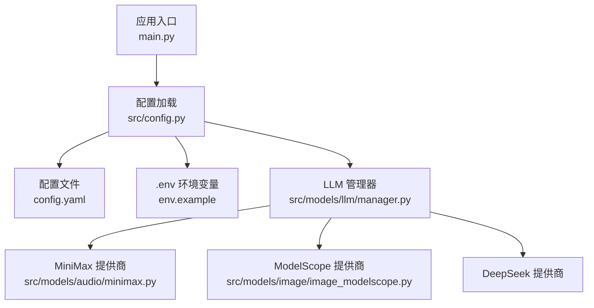
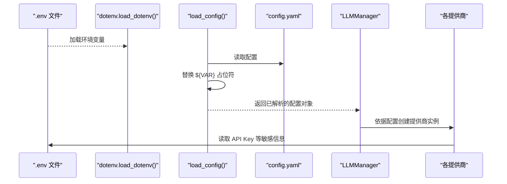
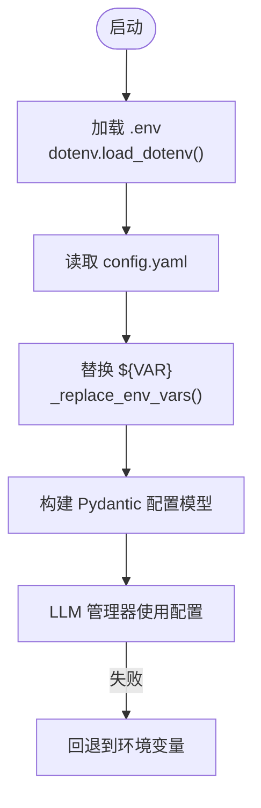
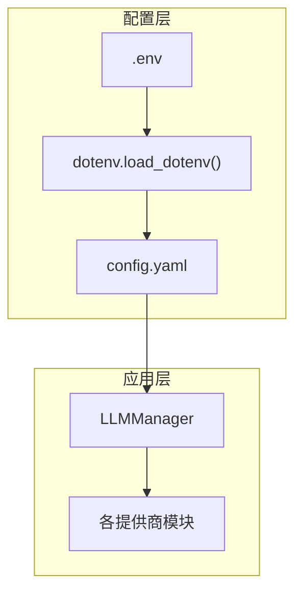

# 环境变量配置

<cite>
**本文档引用的文件**
- [config.yaml](file://config.yaml)
- [env.example](file://env.example)
- [src/config.py](file://src/config.py)
- [src/models/llm/manager.py](file://src/models/llm/manager.py)
- [src/models/audio/minimax.py](file://src/models/audio/minimax.py)
- [src/models/image/image_modelscope.py](file://src/models/image/image_modelscope.py)
- [scripts/test_image_gen.py](file://scripts/test_image_gen.py)
- [README.md](file://README.md)
</cite>

## 目录
1. [简介](#简介)
2. [项目结构](#项目结构)
3. [核心组件](#核心组件)
4. [架构总览](#架构总览)
5. [详细组件分析](#详细组件分析)
6. [依赖关系分析](#依赖关系分析)
7. [性能考量](#性能考量)
8. [故障排除指南](#故障排除指南)
9. [结论](#结论)
10. [附录](#附录)

## 简介
本指南面向 Brief Agent 的使用者与维护者，提供环境变量配置的完整说明。内容涵盖：
- 需要设置的所有环境变量及其用途（包括 MINIMAX_API_KEY、MODELSCOPE_API_KEY、DEEPSEEK_API_KEY 等）
- 安全存储与管理最佳实践
- 不同部署环境（开发、测试、生产）的配置示例
- 环境变量与 config.yaml 的交互关系与优先级
- 验证方法与常见问题排查
- .env 文件的使用方式与安全注意事项

## 项目结构
Brief Agent 通过 config.yaml 配置文件集中管理 LLM 提供商、RSS 源、数据库、向量库、日志与调度等参数；环境变量用于注入敏感信息（如 API Key），并通过 Python 的 dotenv 库在启动时加载。

图表来源
- [src/config.py](file://src/config.py#L74-L88)
- [config.yaml](file://config.yaml#L1-L54)
- [env.example](file://env.example#L1-L10)
- [src/models/llm/manager.py](file://src/models/llm/manager.py#L253-L295)

章节来源
- [README.md](file://README.md#L19-L42)
- [config.yaml](file://config.yaml#L1-L54)
- [env.example](file://env.example#L1-L10)

## 核心组件
本节概述与环境变量相关的关键组件及职责：
- 配置加载器：负责读取 config.yaml，并将其中的 ${VAR} 形式的占位符替换为对应环境变量值，随后以 Pydantic 模型形式返回。
- LLM 管理器：根据配置选择对应的 LLM 提供商（MiniMax、ModelScope、DeepSeek），若配置加载失败则回退到从环境变量直接读取。
- 各提供商模块：分别从环境变量读取 API Key 与可选参数（如 MiniMax 的 GroupId）。

章节来源
- [src/config.py](file://src/config.py#L74-L108)
- [src/models/llm/manager.py](file://src/models/llm/manager.py#L253-L295)
- [src/models/audio/minimax.py](file://src/models/audio/minimax.py#L23-L27)
- [src/models/image/image_modelscope.py](file://src/models/image/image_modelscope.py#L147-L149)

## 架构总览
下图展示了环境变量在系统中的流转路径：应用启动时加载 .env，随后配置加载器读取 config.yaml 并替换占位符，最终由 LLM 管理器与各提供商模块使用这些变量。

图表来源
- [src/config.py](file://src/config.py#L9-L11)
- [src/config.py](file://src/config.py#L74-L108)
- [config.yaml](file://config.yaml#L8-L21)
- [src/models/llm/manager.py](file://src/models/llm/manager.py#L253-L295)

## 详细组件分析

### 环境变量清单与用途
- MINIMAX_API_KEY
  - 用途：MiniMax LLM 与 TTS 服务认证
  - 位置：config.yaml 中的 minimax.api_key 占位符
  - 回退：当配置加载失败时，LLM 管理器会尝试从环境变量读取
- MODELSCOPE_API_KEY
  - 用途：ModelScope/Qwen LLM 与 Z-Image 图片生成服务认证
  - 位置：config.yaml 中的 modelscope.api_key 占位符
  - 回退：当配置加载失败时，LLM 管理器会尝试从环境变量读取
- DEEPSEEK_API_KEY
  - 用途：DeepSeek LLM 服务认证
  - 位置：config.yaml 中的 deepseek.api_key 占位符
  - 回退：当配置加载失败时，LLM 管理器会尝试从环境变量读取
- MINIMAX_GROUP_ID（可选）
  - 用途：MiniMax 服务的组标识，用于特定分组接口调用
  - 位置：MiniMax 提供商模块中读取
- CONFIG_PATH（可选）
  - 用途：自定义配置文件路径，便于在不同环境使用不同的 config.yaml
  - 位置：env.example 中提供示例

章节来源
- [config.yaml](file://config.yaml#L8-L21)
- [env.example](file://env.example#L5-L9)
- [src/models/llm/manager.py](file://src/models/llm/manager.py#L282-L295)
- [src/models/audio/minimax.py](file://src/models/audio/minimax.py#L23-L27)

### 环境变量与 config.yaml 的交互关系与优先级
- 加载顺序
  1) 启动时通过 dotenv.load_dotenv() 加载 .env 文件中的键值对至进程环境
  2) 读取 config.yaml，将其中形如 ${VAR} 的占位符替换为当前环境中对应的值
  3) 将解析后的配置以 Pydantic 模型返回给上层组件使用
- 优先级
  - .env 中的环境变量优先于 config.yaml 中的静态值
  - 若 config.yaml 中存在 ${VAR} 占位符，则必须确保 .env 中存在对应键，否则将被替换为空字符串
  - LLM 管理器在配置加载失败时会回退到从环境变量直接读取，保证最小可用性

图表来源
- [src/config.py](file://src/config.py#L9-L11)
- [src/config.py](file://src/config.py#L74-L108)
- [src/models/llm/manager.py](file://src/models/llm/manager.py#L276-L280)

章节来源
- [src/config.py](file://src/config.py#L74-L108)
- [src/models/llm/manager.py](file://src/models/llm/manager.py#L276-L280)

### 不同部署环境下的配置示例
- 开发环境
  - 在 .env 中设置开发用的 API Key 与较低的抓取频率
  - 示例键值（仅示意，请替换为真实值）：
    - MINIMAX_API_KEY=dev_minimax_key
    - MODELSCOPE_API_KEY=dev_modelscope_key
    - DEEPSEEK_API_KEY=dev_deepseek_key
- 测试环境
  - 使用独立的测试账户与较小的并发/速率限制
  - 可设置 CONFIG_PATH 指向测试专用的 config.yaml
- 生产环境
  - 使用强加密存储（见“安全存储与管理最佳实践”）
  - 严格区分最小权限与访问控制
  - 对外暴露的 .env 不应包含真实密钥，通过平台机密管理服务注入

章节来源
- [env.example](file://env.example#L1-L10)
- [config.yaml](file://config.yaml#L24-L31)

### 安全存储与管理最佳实践
- 不将真实密钥提交到版本控制系统
  - .env 文件应加入 .gitignore
  - 使用平台机密管理服务（如云厂商的密钥管理服务）在部署时注入
- 最小权限原则
  - 为不同提供商分配最小必要的权限范围
  - 定期轮换密钥并撤销旧密钥
- 网络与访问控制
  - 限制密钥访问范围（仅允许必要容器/主机访问）
  - 使用网络隔离与防火墙策略
- 审计与监控
  - 记录密钥使用事件与异常访问
  - 设置告警阈值（如异常调用次数、错误率）

### .env 文件的使用方法与安全注意事项
- 使用步骤
  - 复制示例文件：cp env.example .env
  - 编辑 .env，填入对应 API Key
  - 确保 .env 文件不被提交到仓库
- 安全注意事项
  - .env 文件仅用于本地开发与受控测试环境
  - 生产环境通过平台机密管理服务注入，避免将密钥明文存放在镜像或配置文件中
  - 定期清理与轮换密钥，避免长期使用同一密钥

章节来源
- [README.md](file://README.md#L30-L35)
- [env.example](file://env.example#L1-L10)

## 依赖关系分析
下图展示环境变量在系统中的依赖关系：config.yaml 依赖 dotenv 注入的环境变量，LLM 管理器依赖配置对象，各提供商模块依赖环境变量。

图表来源
- [src/config.py](file://src/config.py#L9-L11)
- [src/config.py](file://src/config.py#L74-L88)
- [src/models/llm/manager.py](file://src/models/llm/manager.py#L253-L295)

章节来源
- [src/config.py](file://src/config.py#L74-L108)
- [src/models/llm/manager.py](file://src/models/llm/manager.py#L253-L295)

## 性能考量
- 环境变量读取成本极低，对整体性能影响可忽略
- 在大规模并发场景下，建议通过平台机密管理服务统一注入，减少本地文件读取与解析开销
- 对于图片生成等高并发场景，结合速率限制与重试策略可提升稳定性（详见各提供商模块）

## 故障排除指南
- 症状：LLM 推理失败或报错提示未配置 API Key
  - 排查要点：
    - 确认 .env 中是否设置了 MINIMAX_API_KEY、MODELSCOPE_API_KEY、DEEPSEEK_API_KEY
    - 确认 config.yaml 中相应 provider 的 api_key 是否为 ${VAR} 占位符且 .env 中存在对应键
    - 若配置加载失败，确认 LLM 管理器是否回退到环境变量读取
- 症状：MiniMax TTS 或图片生成报错
  - 排查要点：
    - 确认 MINIMAX_API_KEY 已正确设置
    - 如使用分组功能，确认 MINIMAX_GROUP_ID 已设置
    - 确认网络可达性与提供商服务状态
- 症状：ModelScope 图片生成失败
  - 排查要点：
    - 确认 MODELSCOPE_API_KEY 已正确设置
    - 检查速率限制与重试策略是否合理
    - 查看日志输出定位具体错误码与消息
- 症状：脚本测试提示未配置 API Key
  - 排查要点：
    - 使用 scripts/test_image_gen.py 进行快速验证
    - 按提示在 .env 中设置 MODELSCOPE_API_KEY 后重新运行

章节来源
- [src/models/llm/manager.py](file://src/models/llm/manager.py#L73-L74)
- [src/models/llm/manager.py](file://src/models/llm/manager.py#L114-L115)
- [src/models/llm/manager.py](file://src/models/llm/manager.py#L168-L169)
- [src/models/audio/minimax.py](file://src/models/audio/minimax.py#L23-L27)
- [src/models/image/image_modelscope.py](file://src/models/image/image_modelscope.py#L147-L149)
- [scripts/test_image_gen.py](file://scripts/test_image_gen.py#L54-L62)

## 结论
- 环境变量是 Brief Agent 中注入敏感配置的核心机制
- 通过 dotenv 与配置加载器的配合，实现了灵活、可移植的配置管理
- 建议在开发、测试、生产三类环境中采用差异化配置，并遵循最小权限与安全存储原则
- 出现问题时，优先检查 .env 与 config.yaml 的对应关系以及提供商模块的回退逻辑

## 附录
- 验证方法
  - 使用 README 中提供的命令运行 fetch/parse/report，观察日志输出
  - 通过 scripts/test_image_gen.py 快速验证图片生成链路
- 关键路径参考
  - 配置加载与占位符替换：[src/config.py](file://src/config.py#L74-L108)
  - LLM 提供商创建与回退逻辑：[src/models/llm/manager.py](file://src/models/llm/manager.py#L253-L295)
  - MiniMax 提供商环境变量读取：[src/models/audio/minimax.py](file://src/models/audio/minimax.py#L23-L27)
  - ModelScope 提供商环境变量读取：[src/models/image/image_modelscope.py](file://src/models/image/image_modelscope.py#L147-L149)