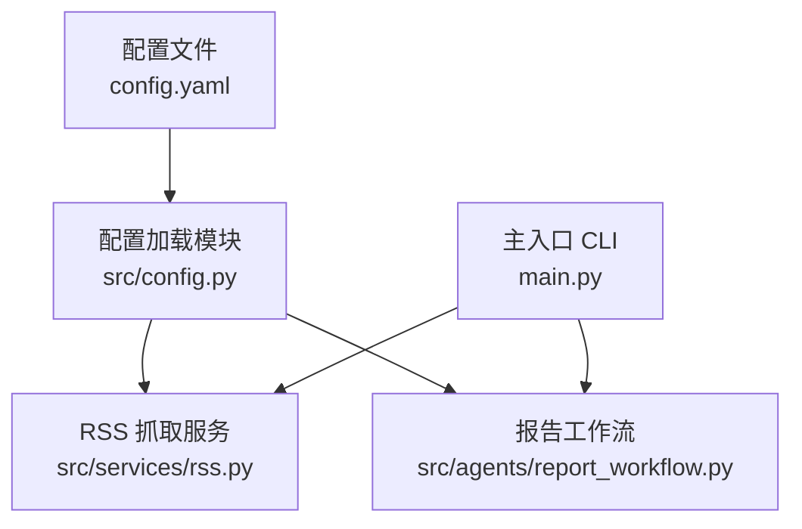
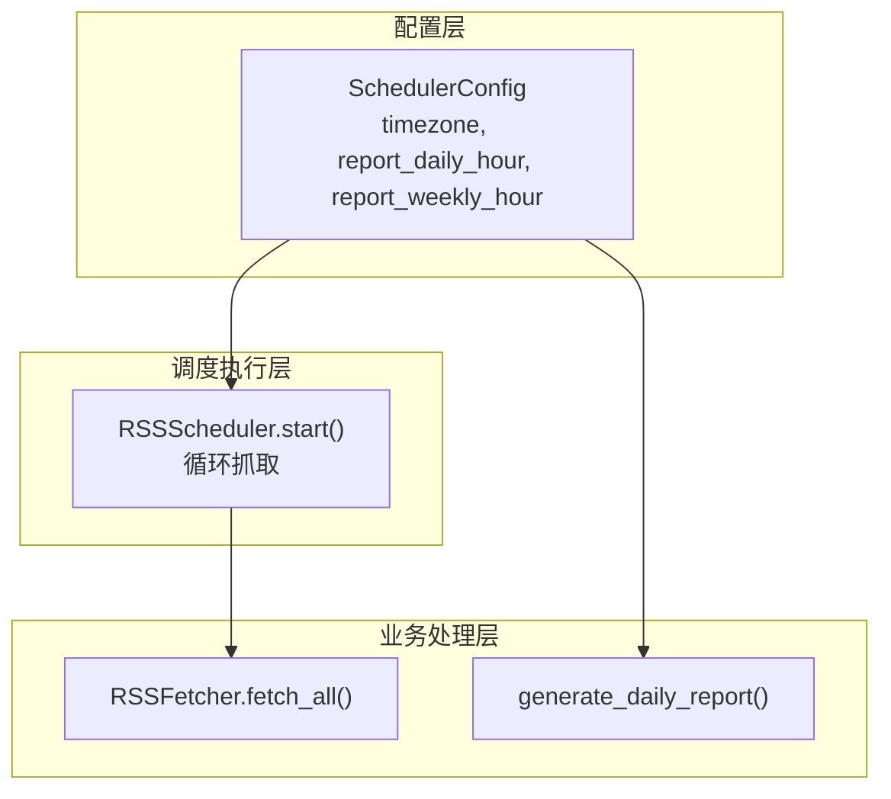
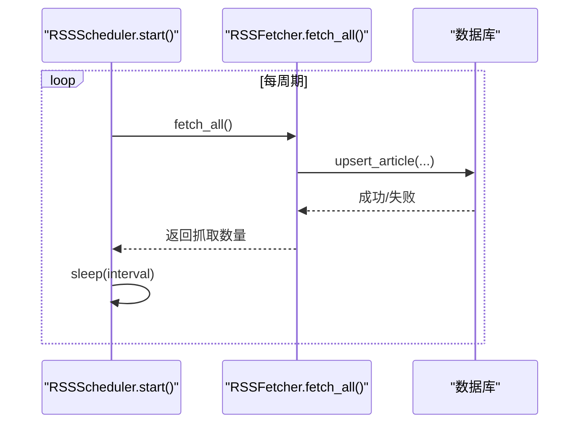
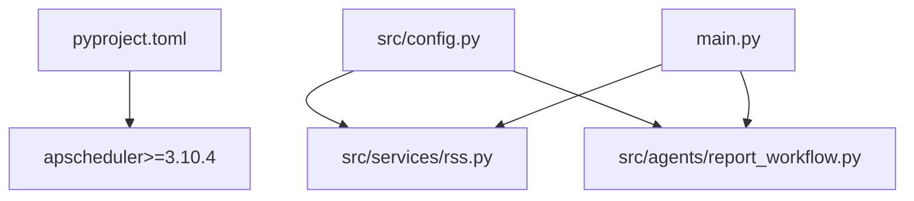

# 调度器配置

<cite>
**本文档引用的文件**
- [config.yaml](file://config.yaml)
- [src/config.py](file://src/config.py)
- [src/services/rss.py](file://src/services/rss.py)
- [src/agents/report_workflow.py](file://src/agents/report_workflow.py)
- [main.py](file://main.py)
- [README.md](file://README.md)
- [pyproject.toml](file://pyproject.toml)
- [uv.lock](file://uv.lock)
</cite>

## 目录
1. [简介](#简介)
2. [项目结构](#项目结构)
3. [核心组件](#核心组件)
4. [架构总览](#架构总览)
5. [详细组件分析](#详细组件分析)
6. [依赖关系分析](#依赖关系分析)
7. [性能考量](#性能考量)
8. [故障排除指南](#故障排除指南)
9. [结论](#结论)
10. [附录](#附录)

## 简介
本指南聚焦于调度器配置，围绕以下关键参数展开：
- scheduler.timezone：时区设置，决定定时任务的本地化基准
- scheduler.report_daily_hour：每日报告生成的执行时刻（小时）
- scheduler.report_weekly_hour：每周报告生成的执行时刻（小时）

同时，本文将解释时区对定时任务的影响、不同业务场景下的调度配置示例、定时任务的触发机制与执行策略、调度器的启动与停止方式、监控与告警建议，以及故障排除与性能调优实践。

## 项目结构
本项目采用“配置即代码”的模式，调度相关配置集中于 YAML 配置文件，并通过 Pydantic 模型在运行时加载与校验。RSS 抓取与报告生成分别由独立的服务与工作流模块负责，调度器以轻量轮询的方式实现周期性任务。

图表来源
- [config.yaml](file://config.yaml#L49-L54)
- [src/config.py](file://src/config.py#L65-L72)
- [src/services/rss.py](file://src/services/rss.py#L110-L122)
- [src/agents/report_workflow.py](file://src/agents/report_workflow.py#L217-L237)
- [main.py](file://main.py#L66-L82)

章节来源
- [config.yaml](file://config.yaml#L1-L54)
- [src/config.py](file://src/config.py#L74-L88)

## 核心组件
- 配置模型与加载
  - SchedulerConfig：定义 scheduler.timezone、scheduler.report_daily_hour、scheduler.report_weekly_hour 三个字段
  - load_config：从 config.yaml 加载并替换环境变量，返回强类型配置对象
- 调度器实现
  - RSSScheduler：基于 apscheduler 的轻量轮询实现，用于 RSS 定时抓取
- 报告生成工作流
  - generate_daily_report：按日期生成日报的工作流入口

章节来源
- [src/config.py](file://src/config.py#L59-L63)
- [src/config.py](file://src/config.py#L74-L88)
- [src/services/rss.py](file://src/services/rss.py#L110-L122)
- [src/agents/report_workflow.py](file://src/agents/report_workflow.py#L217-L237)

## 架构总览
调度器在本项目中的定位与交互如下：

图表来源
- [src/config.py](file://src/config.py#L59-L63)
- [src/services/rss.py](file://src/services/rss.py#L110-L122)
- [src/agents/report_workflow.py](file://src/agents/report_workflow.py#L217-L237)

## 详细组件分析

### 调度器配置详解
- scheduler.timezone
  - 作用：指定调度器使用的时区，影响定时任务的本地化时间基准
  - 影响：当设置为 Asia/Shanghai 时，report_daily_hour 与 report_weekly_hour 以北京时间为准
- scheduler.report_daily_hour
  - 作用：每日报告生成的触发小时（0-23）
  - 影响：结合 timezone，确定每天固定时刻执行
- scheduler.report_weekly_hour
  - 作用：每周报告生成的触发小时（0-23），通常配合周一触发
  - 影响：结合 timezone，确定每周固定时刻执行

章节来源
- [config.yaml](file://config.yaml#L49-L54)
- [README.md](file://README.md#L173-L180)

### 时区对定时任务执行的影响
- 时区决定“本地时间”的基准。例如：
  - 若 timezone 为 Asia/Shanghai，report_daily_hour=8 表示每天北京时间 08:00 执行
  - 若 timezone 为 UTC，report_daily_hour=8 表示每天 UTC 时间 08:00 执行
- 不同时区下，同一小时对应的本地时刻不同，应根据业务所在地区选择合适时区

章节来源
- [config.yaml](file://config.yaml#L51-L53)
- [README.md](file://README.md#L177-L178)

### 业务场景下的调度配置示例
- 工作日执行（周一至周五）
  - timezone: Asia/Shanghai
  - report_daily_hour: 9（上午 9 点）
  - report_weekly_hour: 9（周一上午 9 点）
- 周末执行（仅周末）
  - timezone: Asia/Shanghai
  - report_daily_hour: 10（上午 10 点）
  - report_weekly_hour: 10（周六上午 10 点）
- 全天候抓取（RSS）
  - fetch_interval: 3600（秒）对应 RSS 抓取调度器的周期
  - 注意：该参数位于 rss.fetch_interval，与 scheduler.report_daily_hour、report_weekly_hour 不同

章节来源
- [config.yaml](file://config.yaml#L30)
- [config.yaml](file://config.yaml#L51-L53)
- [README.md](file://README.md#L175-L180)

### 定时任务的触发机制与执行策略
- 触发机制
  - RSS 抓取：RSSScheduler.start() 通过循环 + sleep 实现周期性抓取
  - 报告生成：当前仓库未提供通用的 apscheduler 注册接口；报告生成通过 CLI 命令触发
- 执行策略
  - RSS 抓取：按 rss.fetch_interval 设置的秒数周期执行
  - 报告生成：按 scheduler.report_daily_hour、report_weekly_hour 的时区基准执行（需自行接入 apscheduler）

图表来源
- [src/services/rss.py](file://src/services/rss.py#L117-L122)
- [src/services/rss.py](file://src/services/rss.py#L22-L32)

章节来源
- [src/services/rss.py](file://src/services/rss.py#L110-L122)

### 调度器的启动与停止配置方法
- 启动
  - RSS 抓取：调用 RSSScheduler.start() 进入无限循环抓取
- 停止
  - 当前实现为无限循环，无内置优雅停止信号处理
  - 建议：在生产环境中引入进程管理（如 systemd、supervisor）或信号处理（SIGTERM/SIGINT）以实现优雅退出

章节来源
- [src/services/rss.py](file://src/services/rss.py#L117-L122)

### 定时任务的监控与告警配置
- 日志监控
  - 使用配置中的 logging.level、logging.file、logging.rotation、logging.retention 控制日志级别与轮转
- 告警建议
  - 抓取失败率阈值告警
  - 报告生成耗时超阈值告警
  - 建议结合外部监控系统（如 Prometheus + Alertmanager 或日志平台告警）

章节来源
- [config.yaml](file://config.yaml#L42-L47)
- [src/services/rss.py](file://src/services/rss.py#L30-L31)

## 依赖关系分析
- 外部依赖 apscheduler
  - 版本：>=3.10.4
  - 用途：为后续接入通用调度器（如注册 cron 任务）做准备
- 项目内部依赖
  - 配置加载：src/config.py
  - 调度器：src/services/rss.py
  - 报告工作流：src/agents/report_workflow.py

图表来源
- [pyproject.toml](file://pyproject.toml#L20)
- [uv.lock](file://uv.lock#L156-L166)
- [src/config.py](file://src/config.py#L74-L88)
- [src/services/rss.py](file://src/services/rss.py#L110-L122)
- [src/agents/report_workflow.py](file://src/agents/report_workflow.py#L217-L237)
- [main.py](file://main.py#L66-L82)

章节来源
- [pyproject.toml](file://pyproject.toml#L1-L49)
- [uv.lock](file://uv.lock#L156-L166)

## 性能考量
- RSS 抓取频率
  - rss.fetch_interval 过短可能导致 API 限流或网络拥塞
  - 建议根据上游 RSS 源更新频率与自身资源情况合理设置
- 报告生成成本
  - 日报生成涉及 LLM 推理与数据库 IO，建议在业务低峰时段执行
- 时区与夏令时
  - 选择稳定时区（如 Asia/Shanghai）避免夏令时切换带来的边界问题

## 故障排除指南
- 时区不一致导致的执行偏差
  - 症状：定时任务在本地看起来“早/晚”一小时
  - 处理：核对 scheduler.timezone 是否与业务所在地区一致
- 报告生成失败
  - 检查 LLM 提供商配置与 API Key
  - 查看日志文件与轮转策略
- 抓取失败
  - 检查网络连接与上游 RSS 源可用性
  - 关注 RSSScheduler 的异常日志输出

章节来源
- [config.yaml](file://config.yaml#L42-L47)
- [src/services/rss.py](file://src/services/rss.py#L30-L31)
- [src/agents/report_workflow.py](file://src/agents/report_workflow.py#L179-L181)

## 结论
本项目提供了清晰的调度器配置入口与基础的 RSS 抓取调度实现。对于报告生成的定时执行，建议在现有基础上接入 apscheduler，以实现更灵活的 cron 任务管理。通过合理的时区设置、频率控制与监控告警，可确保调度系统的稳定性与可观测性。

## 附录
- 配置文件位置与加载流程
  - 配置文件：config.yaml
  - 加载流程：src/config.load_config() -> Pydantic 模型校验
- 常用 CLI 与调度关联
  - RSS 抓取：uv run python main.py fetch
  - 报告生成：uv run python main.py report YYYY-MM-DD

章节来源
- [config.yaml](file://config.yaml#L1-L54)
- [src/config.py](file://src/config.py#L74-L88)
- [main.py](file://main.py#L66-L82)