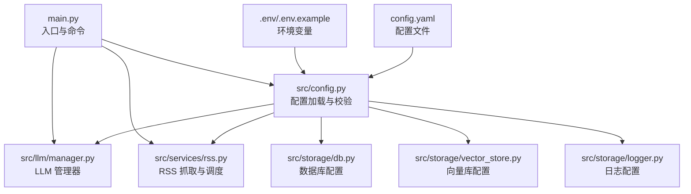
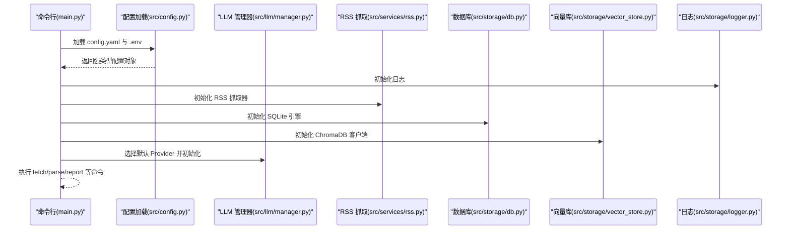
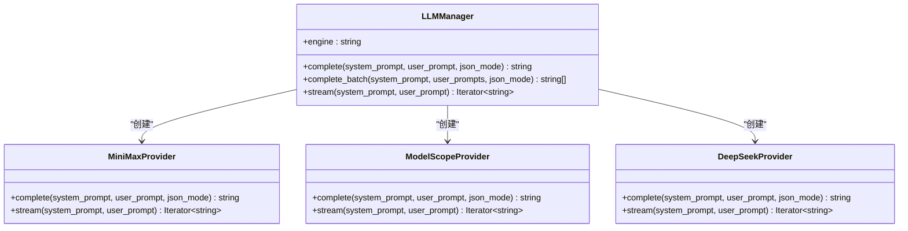
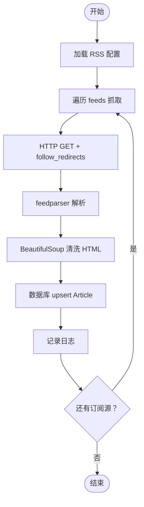
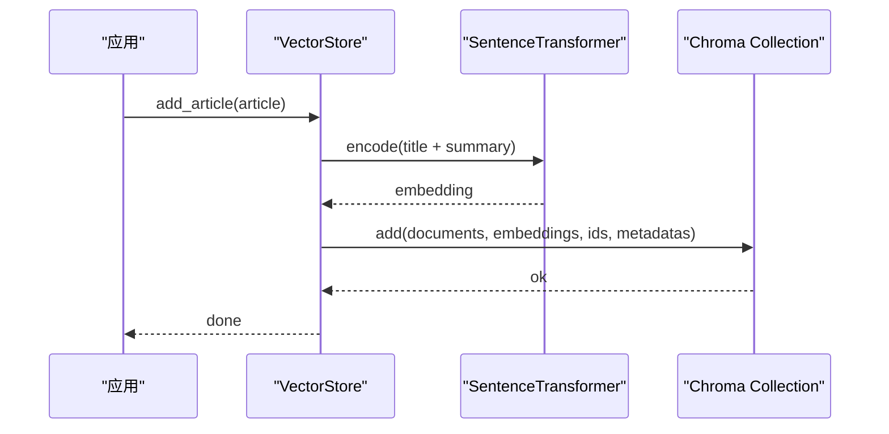

# 配置指南

<cite>
**本文引用的文件**
- [config.yaml](file://config.yaml)
- [env.example](file://env.example)
- [src/config.py](file://src/config.py)
- [src/storage/db.py](file://src/storage/db.py)
- [src/storage/vector_store.py](file://src/storage/vector_store.py)
- [src/services/rss.py](file://src/services/rss.py)
- [src/llm/manager.py](file://src/llm/manager.py)
- [src/storage/logger.py](file://src/storage/logger.py)
- [main.py](file://main.py)
- [scripts/migrate_db.py](file://scripts/migrate_db.py)
- [pyproject.toml](file://pyproject.toml)
</cite>

## 目录
1. [简介](#简介)
2. [项目结构](#项目结构)
3. [核心组件](#核心组件)
4. [架构总览](#架构总览)
5. [详细组件分析](#详细组件分析)
6. [依赖关系分析](#依赖关系分析)
7. [性能考虑](#性能考虑)
8. [故障排除指南](#故障排除指南)
9. [结论](#结论)
10. [附录](#附录)

## 简介
本指南面向 Brief Agent 的使用者与维护者，系统讲解配置体系的设计与使用方法，涵盖 config.yaml 的结构与全部配置项、环境变量注入机制、安全最佳实践、不同运行环境的配置差异、配置优先级与覆盖规则、配置验证与故障排除、配置模板与常用组合，以及配置变更的影响范围与重启要求。

## 项目结构
Brief Agent 的配置由 YAML 配置文件与环境变量共同构成，通过 Python 模块进行加载与校验，并被各子系统（RSS 抓取、数据库、向量库、日志、调度、LLM Provider）消费。



图表来源
- [config.yaml](file://config.yaml#L1-L54)
- [src/config.py](file://src/config.py#L74-L109)
- [src/llm/manager.py](file://src/llm/manager.py#L243-L296)
- [src/services/rss.py](file://src/services/rss.py#L15-L32)
- [src/storage/db.py](file://src/storage/db.py#L65-L80)
- [src/storage/vector_store.py](file://src/storage/vector_store.py#L15-L35)
- [src/storage/logger.py](file://src/storage/logger.py#L8-L39)
- [main.py](file://main.py#L54-L64)

章节来源
- [config.yaml](file://config.yaml#L1-L54)
- [src/config.py](file://src/config.py#L74-L109)
- [main.py](file://main.py#L54-L64)

## 核心组件
- 配置加载与校验：通过 Pydantic 模型对 config.yaml 进行结构化校验；支持环境变量占位符替换。
- LLM Provider：支持 MiniMax、ModelScope、DeepSeek，可通过默认 provider 快速切换。
- RSS：订阅源、抓取间隔、超时、HTML 清洗与入库。
- 数据库：SQLite，基于 SQLModel 管理表结构与事务。
- 向量库：ChromaDB 持久化，SentenceTransformer 嵌入，支持语义检索。
- 日志：基于 loguru 的滚动日志与控制台输出。
- 调度：RSS 抓取定时任务（当前实现为循环定时器）。

章节来源
- [src/config.py](file://src/config.py#L14-L72)
- [src/llm/manager.py](file://src/llm/manager.py#L206-L296)
- [src/services/rss.py](file://src/services/rss.py#L15-L32)
- [src/storage/db.py](file://src/storage/db.py#L65-L80)
- [src/storage/vector_store.py](file://src/storage/vector_store.py#L15-L35)
- [src/storage/logger.py](file://src/storage/logger.py#L8-L39)

## 架构总览
下图展示配置在系统中的流向与影响范围：



图表来源
- [main.py](file://main.py#L54-L64)
- [src/config.py](file://src/config.py#L74-L109)
- [src/llm/manager.py](file://src/llm/manager.py#L243-L296)
- [src/services/rss.py](file://src/services/rss.py#L15-L32)
- [src/storage/db.py](file://src/storage/db.py#L65-L80)
- [src/storage/vector_store.py](file://src/storage/vector_store.py#L15-L35)
- [src/storage/logger.py](file://src/storage/logger.py#L8-L39)

## 详细组件分析

### 配置文件结构与字段详解
- llm.default：默认使用的 LLM Provider 名称（minimax、modelscope、deepseek）。
- llm.providers.*：各 Provider 的具体配置，包含 provider、api_key、base_url、model。
- rss.feeds[]：订阅源数组，每项包含 url 与 name。
- rss.fetch_interval：RSS 抓取周期（秒）。
- rss.timeout：HTTP 请求超时（秒）。
- database.path：SQLite 数据库存放路径。
- vector_db.path：ChromaDB 持久化目录。
- vector_db.collection：向量集合名称。
- logging.level：日志级别。
- logging.file：日志文件路径。
- logging.rotation：日志轮转大小。
- logging.retention：日志保留天数。
- scheduler.timezone：时区。
- scheduler.report_daily_hour：每日报告生成小时（24 小时制）。
- scheduler.report_weekly_hour：每周报告生成小时（周一）。

章节来源
- [config.yaml](file://config.yaml#L1-L54)
- [src/config.py](file://src/config.py#L14-L72)

### 环境变量注入与优先级
- 占位符语法：${ENV_VAR}，在加载 YAML 后会被替换为对应环境变量值。
- 未设置环境变量时，替换逻辑会回退为空字符串。
- 若配置文件中未提供某 Provider 的 api_key，将尝试从环境变量读取。
- 可通过环境变量 CONFIG_PATH 指定自定义配置文件路径。

章节来源
- [src/config.py](file://src/config.py#L91-L109)
- [env.example](file://env.example#L1-L10)
- [src/llm/manager.py](file://src/llm/manager.py#L276-L296)

### LLM Provider 配置
- 支持 Provider：MiniMax、ModelScope、DeepSeek。
- 默认 Provider 由 llm.default 指定。
- Provider 初始化顺序：优先使用 config.yaml 中的 providers.* 配置；若失败或缺失，则回退到环境变量。
- 不同 Provider 的 base_url 与 model 已内置，可在 config.yaml 中覆盖。



图表来源
- [src/llm/manager.py](file://src/llm/manager.py#L206-L296)

章节来源
- [src/llm/manager.py](file://src/llm/manager.py#L206-L296)
- [config.yaml](file://config.yaml#L3-L22)

### RSS 订阅源设置
- feeds[]：多个订阅源，每个包含 url 与 name。
- fetch_interval：抓取周期（秒），用于定时任务。
- timeout：HTTP 请求超时（秒）。
- 抓取流程：解析 RSS、清洗 HTML、入库（upsert）、记录日志。



图表来源
- [src/services/rss.py](file://src/services/rss.py#L22-L61)
- [src/storage/db.py](file://src/storage/db.py#L97-L123)

章节来源
- [src/services/rss.py](file://src/services/rss.py#L15-L32)
- [src/storage/db.py](file://src/storage/db.py#L97-L123)

### 数据库配置（SQLite）
- 路径：database.path。
- 初始化：首次使用自动创建表结构（Articles、ArticleAnalysis、FeedConfigs、Reports）。
- 性能：启用 WAL 模式与 busy_timeout，提升并发读写能力。
- 迁移：提供脚本将旧表结构与数据迁移到新的 SQLModel 表结构。

```mermaid
erDiagram
ARTICLES {
int id PK
string feed_name
string title
string url UK
string summary
string content
datetime published_at
datetime fetched_at
string tags
}
ARTICLE_ANALYSIS {
int id PK
int article_id UK FK
string summary_llm
string keywords
string category
string sentiment
string parsed_at
}
FEED_CONFIGS {
int id PK
string url UK
string name
string last_fetched
}
REPORTS {
int id PK
string report_type
string date_range
text content
string created_at
}
ARTICLES ||--|| ARTICLE_ANALYSIS : "1:1 关联"
```

图表来源
- [src/storage/db.py](file://src/storage/db.py#L14-L61)

章节来源
- [src/storage/db.py](file://src/storage/db.py#L65-L80)
- [scripts/migrate_db.py](file://scripts/migrate_db.py#L15-L87)

### 向量数据库配置（RAG）
- 路径：vector_db.path。
- 集合：vector_db.collection。
- 嵌入模型：SentenceTransformer（all-MiniLM-L6-v2）。
- 功能：添加/批量添加文章、语义检索、按日期范围检索、删除文章、统计数量。



图表来源
- [src/storage/vector_store.py](file://src/storage/vector_store.py#L36-L54)

章节来源
- [src/storage/vector_store.py](file://src/storage/vector_store.py#L15-L35)

### 日志配置
- level：日志级别。
- file：日志文件路径（自动创建目录）。
- rotation：日志轮转大小。
- retention：日志保留时间。
- 控制台输出：同时输出到控制台，便于本地调试。

章节来源
- [src/storage/logger.py](file://src/storage/logger.py#L8-L39)
- [config.yaml](file://config.yaml#L42-L47)

### 调度配置
- timezone：时区。
- report_daily_hour：每日报告生成时间（24 小时制）。
- report_weekly_hour：每周报告生成时间（周一）。
- RSS 抓取定时器：当前实现为循环定时器，周期来自 rss.fetch_interval。

章节来源
- [config.yaml](file://config.yaml#L49-L54)
- [src/services/rss.py](file://src/services/rss.py#L110-L123)

## 依赖关系分析
- 配置加载依赖：PyYAML、python-dotenv、pydantic。
- LLM Provider 依赖：openai（ModelScope/DeepSeek）、requests（MiniMax）。
- RSS 依赖：feedparser、beautifulsoup4、httpx。
- 数据库依赖：sqlmodel、sqlalchemy。
- 向量库依赖：chromadb、sentence-transformers。
- 日志依赖：loguru。
- 调度依赖：apscheduler（声明存在，当前 RSS 抓取使用循环定时器）。

章节来源
- [pyproject.toml](file://pyproject.toml#L7-L29)

## 性能考虑
- 数据库：WAL 模式与 busy_timeout 提升并发；建议在高并发场景下评估连接池与锁竞争。
- 向量库：批量添加（add_articles）优于逐条添加；检索时可按 feed_name 或日期范围过滤以减少计算量。
- LLM：批量推理使用线程池并发调用，注意 API 速率限制与并发度设置。
- RSS：合理设置 fetch_interval 与 timeout，避免频繁抓取导致外部源限流。

[本节为通用指导，无需列出章节来源]

## 故障排除指南
- 环境变量未生效
  - 确认 .env 文件已复制为 .env 并包含所需密钥。
  - 确认 CONFIG_PATH 是否被设置且指向有效配置文件。
  - 检查占位符 ${VAR} 是否拼写正确。
  - 参考：[src/config.py](file://src/config.py#L91-L109)、[env.example](file://env.example#L1-L10)
- LLM Provider 报错
  - 检查对应 Provider 的 api_key 是否在 .env 或 config.yaml 中正确配置。
  - 确认网络可达与 base_url 正确。
  - 参考：[src/llm/manager.py](file://src/llm/manager.py#L276-L296)
- RSS 抓取失败
  - 检查订阅源 URL 是否可访问，确认 timeout 设置合理。
  - 查看日志中 HTTP 错误与解析异常。
  - 参考：[src/services/rss.py](file://src/services/rss.py#L34-L48)
- 数据库无法初始化
  - 确认 database.path 目录可写。
  - 如需迁移旧数据，执行迁移脚本。
  - 参考：[src/storage/db.py](file://src/storage/db.py#L65-L80)、[scripts/migrate_db.py](file://scripts/migrate_db.py#L15-L87)
- 向量库检索异常
  - 确认 vector_db.path 可写，集合已创建。
  - 检查嵌入模型是否可用。
  - 参考：[src/storage/vector_store.py](file://src/storage/vector_store.py#L15-L35)
- 日志不输出
  - 检查 logging.file 路径与权限，确认 level 设置。
  - 参考：[src/storage/logger.py](file://src/storage/logger.py#L8-L39)

章节来源
- [src/config.py](file://src/config.py#L91-L109)
- [src/llm/manager.py](file://src/llm/manager.py#L276-L296)
- [src/services/rss.py](file://src/services/rss.py#L34-L48)
- [src/storage/db.py](file://src/storage/db.py#L65-L80)
- [src/storage/vector_store.py](file://src/storage/vector_store.py#L15-L35)
- [src/storage/logger.py](file://src/storage/logger.py#L8-L39)
- [scripts/migrate_db.py](file://scripts/migrate_db.py#L15-L87)

## 结论
Brief Agent 的配置体系以 YAML 为主、环境变量为辅，结合 Pydantic 的强类型校验确保配置一致性。通过模块化的组件设计，配置变更可精确影响相应子系统。建议在团队内统一 .env 管理与密钥轮换策略，定期验证配置有效性，并在生产环境启用更严格的日志与监控。

[本节为总结性内容，无需列出章节来源]

## 附录

### 配置模板与常用组合
- 最小可用配置
  - llm.default 指定一个 Provider。
  - 在 .env 中设置对应 api_key。
  - database.path 指向可写路径。
  - vector_db.path 指向可写路径。
  - logging.file 指向可写路径。
- 生产环境建议
  - 将 rss.fetch_interval 设为 1 小时以上，避免对外部源造成压力。
  - 启用更严格的日志级别（如 INFO/ERROR），并配置合理的 rotation 与 retention。
  - 使用稳定的磁盘路径作为 database.path 与 vector_db.path。
- 开发/测试环境建议
  - 将 rss.fetch_interval 设为较短周期（如 300 秒）以便快速验证。
  - 将 logging.level 设为 DEBUG，便于排查问题。
  - 使用临时目录存放 database.path 与 vector_db.path，便于清理。

[本节为通用指导，无需列出章节来源]

### 配置变更的影响范围与重启要求
- LLM Provider 变更
  - 影响范围：所有依赖 LLM 的解析与生成流程。
  - 重启要求：无需重启进程，LLMManager 会在初始化时读取最新配置。
- RSS 抓取配置变更
  - 影响范围：定时抓取行为、超时与订阅源列表。
  - 重启要求：RSS 抓取定时器当前为循环实现，变更后需重启进程以应用新周期。
- 数据库/向量库路径变更
  - 影响范围：数据持久化位置。
  - 重启要求：需重启进程以重新连接新路径。
- 日志配置变更
  - 影响范围：日志输出位置与轮转策略。
  - 重启要求：需重启进程以重新初始化日志系统。
- 调度配置变更
  - 影响范围：报告生成时间点。
  - 重启要求：RSS 抓取定时器当前为循环实现，变更后需重启进程。

章节来源
- [src/llm/manager.py](file://src/llm/manager.py#L243-L296)
- [src/services/rss.py](file://src/services/rss.py#L110-L123)
- [src/storage/db.py](file://src/storage/db.py#L65-L80)
- [src/storage/vector_store.py](file://src/storage/vector_store.py#L15-L35)
- [src/storage/logger.py](file://src/storage/logger.py#L8-L39)