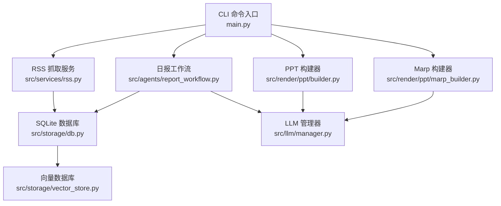
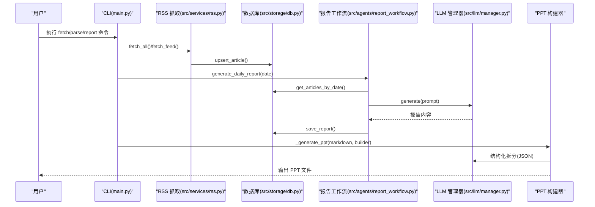
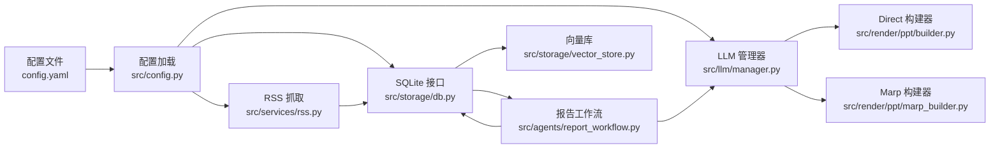

# 使用场景与案例

<cite>
**本文引用的文件**
- [README.md](file://README.md)
- [config.yaml](file://config.yaml)
- [main.py](file://main.py)
- [src/config.py](file://src/config.py)
- [src/services/rss.py](file://src/services/rss.py)
- [src/agents/report_workflow.py](file://src/agents/report_workflow.py)
- [src/storage/db.py](file://src/storage/db.py)
- [src/render/ppt/builder.py](file://src/render/ppt/builder.py)
- [src/render/ppt/marp_builder.py](file://src/render/ppt/marp_builder.py)
- [src/render/ppt/templates/default.md](file://src/render/ppt/templates/default.md)
- [src/llm/manager.py](file://src/llm/manager.py)
- [src/models/llm/manager.py](file://src/models/llm/manager.py)
- [src/storage/vector_store.py](file://src/storage/vector_store.py)
- [scripts/fetch_sample.py](file://scripts/fetch_sample.py)
- [env.example](file://env.example)
</cite>

## 目录
1. [简介](#简介)
2. [项目结构](#项目结构)
3. [核心组件](#核心组件)
4. [架构总览](#架构总览)
5. [详细场景与案例](#详细场景与案例)
6. [依赖关系分析](#依赖关系分析)
7. [性能考量](#性能考量)
8. [故障排查指南](#故障排查指南)
9. [结论](#结论)
10. [附录](#附录)

## 简介
Brief Agent 是一个基于 LangGraph 的多模态内容自动生成与分发平台，面向企业级知识内生场景，提供“多源数据采集（RSS）、AI 智能分析（多 Agent 协作）、短视频脚本生成、视频渲染输出、RAG 向量化检索、日报/周报生成、定时任务调度”等能力。用户可通过 CLI 命令完成从 RSS 抓取、文章解析、报告生成到 PPT 输出的全流程自动化。

## 项目结构
项目采用按功能域划分的模块化组织方式，核心模块包括：
- CLI 入口与命令：main.py
- 配置加载：src/config.py
- RSS 抓取与调度：src/services/rss.py
- 报告生成工作流（LangGraph）：src/agents/report_workflow.py
- 数据存储（SQLite/ChromaDB）：src/storage/db.py、src/storage/vector_store.py
- 渲染输出（PPT）：src/render/ppt/builder.py、src/render/ppt/marp_builder.py、src/render/ppt/templates/default.md
- LLM 管理器：src/llm/manager.py、src/models/llm/manager.py
- 示例脚本：scripts/fetch_sample.py
- 环境变量模板：env.example

图表来源
- [main.py](file://main.py#L66-L141)
- [src/services/rss.py](file://src/services/rss.py#L15-L60)
- [src/agents/report_workflow.py](file://src/agents/report_workflow.py#L186-L237)
- [src/storage/db.py](file://src/storage/db.py#L65-L90)
- [src/render/ppt/builder.py](file://src/render/ppt/builder.py#L22-L84)
- [src/render/ppt/marp_builder.py](file://src/render/ppt/marp_builder.py#L21-L94)
- [src/llm/manager.py](file://src/llm/manager.py#L206-L318)
- [src/storage/vector_store.py](file://src/storage/vector_store.py#L15-L35)

章节来源
- [README.md](file://README.md#L87-L148)

## 核心组件
- 配置系统：通过 YAML 配置 LLM 提供商、RSS 源、数据库、向量库、日志与调度参数，并支持从 .env 注入环境变量。
- RSS 抓取与解析：支持多源 RSS 订阅、超时控制、HTML 清洗、去重入库。
- 报告生成工作流：LangGraph 驱动的多节点工作流，负责收集、组织、生成与保存日报。
- LLM 管理器：统一接入 MiniMax、ModelScope、DeepSeek，支持单次/批量/流式调用。
- 渲染输出：提供两种 PPT 构建器（DirectPPBuilder、MarpPPBuilder），支持模板与 JSON 结构化输出。
- 向量检索：基于 ChromaDB 的 RAG 存储与查询，支撑知识增强与检索。

章节来源
- [src/config.py](file://src/config.py#L74-L109)
- [src/services/rss.py](file://src/services/rss.py#L15-L60)
- [src/agents/report_workflow.py](file://src/agents/report_workflow.py#L186-L237)
- [src/llm/manager.py](file://src/llm/manager.py#L206-L318)
- [src/render/ppt/builder.py](file://src/render/ppt/builder.py#L22-L84)
- [src/render/ppt/marp_builder.py](file://src/render/ppt/marp_builder.py#L21-L94)
- [src/storage/vector_store.py](file://src/storage/vector_store.py#L15-L35)

## 架构总览
下图展示了从 RSS 抓取到报告生成与 PPT 输出的端到端流程：

图表来源
- [main.py](file://main.py#L66-L141)
- [src/services/rss.py](file://src/services/rss.py#L22-L60)
- [src/storage/db.py](file://src/storage/db.py#L147-L151)
- [src/agents/report_workflow.py](file://src/agents/report_workflow.py#L217-L237)
- [src/llm/manager.py](file://src/llm/manager.py#L206-L318)
- [src/render/ppt/builder.py](file://src/render/ppt/builder.py#L143-L188)

## 详细场景与案例

### 企业知识管理（智能日报/周报）
适用场景
- 企业需要每日/每周汇总行业资讯、内部动态，形成结构化简报，便于管理层快速掌握全局。
- 通过 RSS 订阅多源资讯，经 LLM 结构化生成“今日概览 + 重点资讯 + 链接索引”的标准格式。

实施步骤
1) 配置 RSS 源与 LLM 提供商
- 在配置文件中添加多个 RSS 源与提供商信息。
- 设置数据库与向量库路径，确保日志级别与轮转策略合理。
- 参考配置项与默认值：[配置说明](file://README.md#L43-L76)、[配置文件样例](file://config.yaml#L24-L53)。

2) 准备环境变量
- 复制示例环境文件并填入对应 API Key。
- 参考：[环境变量模板](file://env.example#L4-L7)。

3) 数据采集与解析
- 抓取 RSS：运行抓取命令，将文章写入 SQLite。
- 解析未处理文章：调用 LLM 对文章进行摘要、关键词、情感与分类标注，写入 article_analysis。
- 参考命令与实现：[CLI fetch/parse](file://main.py#L66-L105)、[RSS 抓取](file://src/services/rss.py#L22-L60)、[数据库接口](file://src/storage/db.py#L97-L123)。

4) 生成日报/周报
- 指定日期生成日报，工作流按分类组织文章并调用 LLM 生成结构化内容，保存至 reports。
- 参考：[报告工作流](file://src/agents/report_workflow.py#L186-L237)、[CLI report](file://main.py#L107-L141)。

5) 输出 PPT
- 可选生成 PPT，支持 direct 与 marp 两种构建器；direct 直接渲染，marp 通过 Marp CLI 渲染。
- 参考：[PPT 构建器](file://src/render/ppt/builder.py#L22-L84)、[Marp 构建器](file://src/render/ppt/marp_builder.py#L21-L94)。

6) 定时任务
- 在调度配置中设置时区与生成时间，结合系统计划任务或后台守护进程实现自动化。
- 参考：[调度配置](file://config.yaml#L49-L53)、[README 调度说明](file://README.md#L173-L180)。

7) RAG 增强（可选）
- 将文章标题与摘要向量化存入 ChromaDB，用于后续检索增强或二次加工。
- 参考：[向量存储](file://src/storage/vector_store.py#L15-L35)。

配置示例（节选）
- LLM 提供商与模型：[配置片段](file://config.yaml#L4-L21)
- RSS 源与抓取间隔：[配置片段](file://config.yaml#L24-L31)
- 数据库与向量库：[配置片段](file://config.yaml#L34-L41)
- 日志与调度：[配置片段](file://config.yaml#L43-L53)

命令行示例（节选）
- 抓取 RSS：[命令](file://README.md#L80-L85)
- 解析文章：[命令](file://README.md#L80-L85)
- 生成日报：[命令](file://README.md#L80-L85)
- 生成 PPT：[CLI 参数](file://main.py#L107-L141)

章节来源
- [README.md](file://README.md#L43-L85)
- [config.yaml](file://config.yaml#L4-L53)
- [env.example](file://env.example#L4-L7)
- [main.py](file://main.py#L66-L141)
- [src/services/rss.py](file://src/services/rss.py#L22-L60)
- [src/storage/db.py](file://src/storage/db.py#L97-L123)
- [src/agents/report_workflow.py](file://src/agents/report_workflow.py#L186-L237)
- [src/render/ppt/builder.py](file://src/render/ppt/builder.py#L22-L84)
- [src/render/ppt/marp_builder.py](file://src/render/ppt/marp_builder.py#L21-L94)
- [src/storage/vector_store.py](file://src/storage/vector_store.py#L15-L35)

### 媒体内容生产（资讯聚合与短视频脚本）
适用场景
- 媒体团队需要快速聚合多源资讯，形成短视频脚本与 PPT 内容素材，提高内容生产效率。

实施步骤
1) RSS 聚合
- 配置多个垂直领域 RSS 源，如科技、商业、政策等。
- 参考：[RSS 配置](file://config.yaml#L24-L31)、[RSS 抓取实现](file://src/services/rss.py#L22-L60)。

2) 文章解析与结构化
- 使用 LLM 对文章进行摘要、关键词抽取与情感分析，便于后续筛选与脚本创作。
- 参考：[解析接口](file://src/storage/db.py#L169-L191)。

3) 脚本生成与 PPT 输出
- 将日报内容交由 LLM 拆分为 PPT 幻灯片结构，再由 PPT 构建器渲染输出。
- 参考：[PPT 结构化提示](file://main.py#L29-L51)、[PPT 构建器](file://src/render/ppt/builder.py#L128-L151)。

章节来源
- [config.yaml](file://config.yaml#L24-L31)
- [src/services/rss.py](file://src/services/rss.py#L22-L60)
- [src/storage/db.py](file://src/storage/db.py#L169-L191)
- [main.py](file://main.py#L29-L51)
- [src/render/ppt/builder.py](file://src/render/ppt/builder.py#L128-L151)

### 教育培训（课程资料整理与讲义生成）
适用场景
- 教师或培训师需要将多篇行业文章整理为课程讲义或复习提纲，形成结构化讲义。

实施步骤
1) 选择 RSS 源
- 配置教育/专业相关的 RSS 源，保证内容质量与时效性。
- 参考：[RSS 配置](file://config.yaml#L24-L31)。

2) 生成结构化讲义
- 使用日报工作流生成“今日概览 + 分类要点 + 链接索引”，作为讲义框架。
- 参考：[报告生成](file://src/agents/report_workflow.py#L95-L161)。

3) PPT 输出
- 选择 marp 模板风格，生成符合教学场景的 PPT。
- 参考：[Marp 构建器](file://src/render/ppt/marp_builder.py#L21-L94)、[模板样式](file://src/render/ppt/templates/default.md#L1-L36)。

章节来源
- [config.yaml](file://config.yaml#L24-L31)
- [src/agents/report_workflow.py](file://src/agents/report_workflow.py#L95-L161)
- [src/render/ppt/marp_builder.py](file://src/render/ppt/marp_builder.py#L21-L94)
- [src/render/ppt/templates/default.md](file://src/render/ppt/templates/default.md#L1-L36)

### 营销传播（竞品监测与周报）
适用场景
- 市场与品牌团队需要对竞品动态、行业趋势进行持续监测，形成周报辅助决策。

实施步骤
1) 定时抓取
- 设置合理的抓取间隔与超时，避免频繁请求导致限流。
- 参考：[RSS 抓取与超时](file://src/services/rss.py#L37-L42)、[抓取间隔](file://config.yaml#L30)。

2) 周报生成
- 指定周起止日期，工作流自动组织分类并生成周报内容。
- 参考：[CLI report](file://main.py#L107-L141)、[报告生成](file://src/agents/report_workflow.py#L217-L237)。

3) PPT 输出与分发
- 使用 marp 模板风格输出周报 PPT，便于会议展示与分享。
- 参考：[Marp 构建器](file://src/render/ppt/marp_builder.py#L21-L94)。

章节来源
- [src/services/rss.py](file://src/services/rss.py#L37-L42)
- [config.yaml](file://config.yaml#L30)
- [main.py](file://main.py#L107-L141)
- [src/agents/report_workflow.py](file://src/agents/report_workflow.py#L217-L237)
- [src/render/ppt/marp_builder.py](file://src/render/ppt/marp_builder.py#L21-L94)

## 依赖关系分析
- 配置加载：config.yaml 通过 src/config.py 加载，支持环境变量注入。
- 数据流：RSS 抓取写入 SQLite，报告工作流读取并生成内容，PPT 构建器消费结构化数据。
- LLM 适配：LLMManager 统一管理多家提供商，支持批量与流式调用。
- 渲染链路：DirectPPBuilder 直接渲染，MarpPPBuilder 依赖 Marp CLI 与模板。

图表来源
- [src/config.py](file://src/config.py#L74-L109)
- [src/llm/manager.py](file://src/llm/manager.py#L206-L318)
- [src/services/rss.py](file://src/services/rss.py#L15-L60)
- [src/storage/db.py](file://src/storage/db.py#L65-L90)
- [src/agents/report_workflow.py](file://src/agents/report_workflow.py#L186-L237)
- [src/render/ppt/builder.py](file://src/render/ppt/builder.py#L22-L84)
- [src/render/ppt/marp_builder.py](file://src/render/ppt/marp_builder.py#L21-L94)
- [src/storage/vector_store.py](file://src/storage/vector_store.py#L15-L35)

章节来源
- [src/config.py](file://src/config.py#L74-L109)
- [src/llm/manager.py](file://src/llm/manager.py#L206-L318)
- [src/services/rss.py](file://src/services/rss.py#L15-L60)
- [src/storage/db.py](file://src/storage/db.py#L65-L90)
- [src/agents/report_workflow.py](file://src/agents/report_workflow.py#L186-L237)
- [src/render/ppt/builder.py](file://src/render/ppt/builder.py#L22-L84)
- [src/render/ppt/marp_builder.py](file://src/render/ppt/marp_builder.py#L21-L94)
- [src/storage/vector_store.py](file://src/storage/vector_store.py#L15-L35)

## 性能考量
- 并发与批处理：LLM 批量推理使用线程池，建议根据提供商速率限制与资源情况调整并发度。
- 数据库性能：SQLite 启用 WAL 模式与超时配置，提升并发读写稳定性。
- 向量化检索：ChromaDB 采用本地持久化，注意磁盘空间与集合规模。
- 渲染效率：DirectPPBuilder 直接渲染，Marp 渲染依赖外部 CLI，需确保环境可用与模板加载。

## 故障排查指南
- RSS 抓取失败
  - 检查网络与超时设置、RSS 源有效性与重定向。
  - 参考：[RSS 抓取异常处理](file://src/services/rss.py#L37-L48)。
- LLM 调用异常
  - 确认 API Key 与提供商配置正确，必要时切换默认提供商。
  - 参考：[LLM 管理器初始化](file://src/llm/manager.py#L253-L281)。
- 报告生成失败
  - 检查数据库中是否存在已解析文章，确认工作流状态与错误信息。
  - 参考：[报告保存与状态](file://src/agents/report_workflow.py#L163-L182)。
- PPT 渲染问题
  - DirectPPBuilder 不依赖外部工具，Marp 需要安装 CLI 并指定模板。
  - 参考：[Marp CLI 查找与渲染](file://src/render/ppt/marp_builder.py#L40-L94)。
- 日志定位
  - 查看日志文件路径与轮转策略，定位具体错误堆栈。
  - 参考：[日志配置](file://config.yaml#L43-L47)。

章节来源
- [src/services/rss.py](file://src/services/rss.py#L37-L48)
- [src/llm/manager.py](file://src/llm/manager.py#L253-L281)
- [src/agents/report_workflow.py](file://src/agents/report_workflow.py#L163-L182)
- [src/render/ppt/marp_builder.py](file://src/render/ppt/marp_builder.py#L40-L94)
- [config.yaml](file://config.yaml#L43-L47)

## 结论
Brief Agent 提供了从数据采集、智能解析、报告生成到 PPT 输出的一体化能力，适用于企业知识管理、媒体内容生产、教育培训与营销传播等多种场景。通过灵活的配置与多提供商 LLM 支持，用户可以快速搭建自动化内容流水线，并根据业务需求定制 RSS 源、报告格式与输出模板。

## 附录

### 常用命令清单
- 抓取 RSS：[命令](file://README.md#L80-L85)
- 解析文章：[命令](file://README.md#L80-L85)
- 生成日报：[命令](file://README.md#L80-L85)
- 启动服务（占位）：[命令](file://README.md#L80-L85)

### 配置文件关键字段说明
- LLM 提供商与模型：[配置片段](file://config.yaml#L4-L21)
- RSS 源与抓取间隔：[配置片段](file://config.yaml#L24-L31)
- 数据库与向量库：[配置片段](file://config.yaml#L34-L41)
- 日志与调度：[配置片段](file://config.yaml#L43-L53)

### 示例脚本
- 快速抓取示例数据：[脚本](file://scripts/fetch_sample.py#L16-L68)