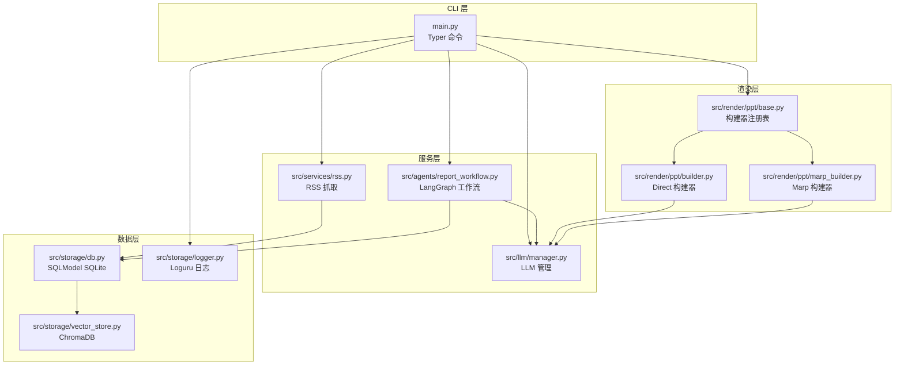
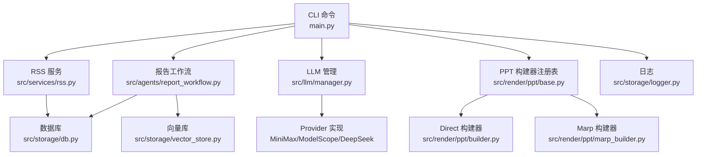
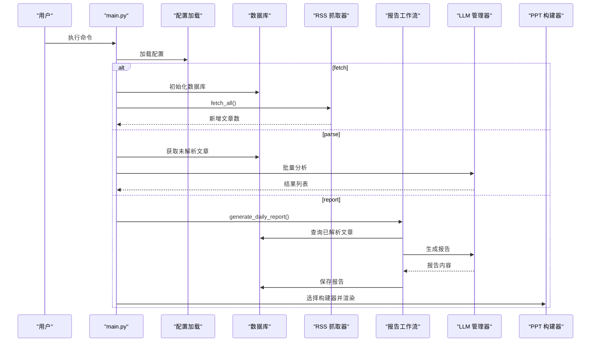
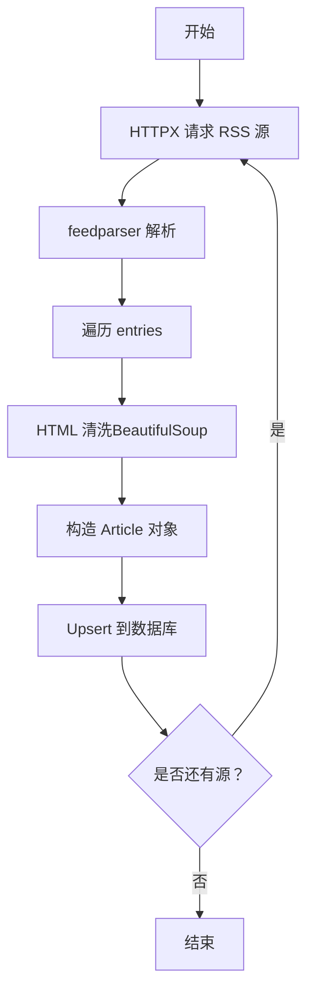
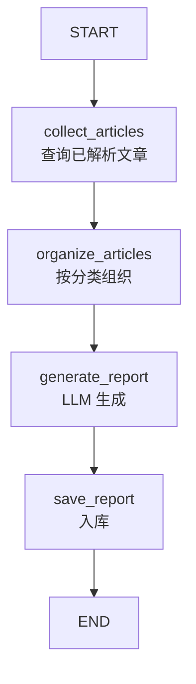
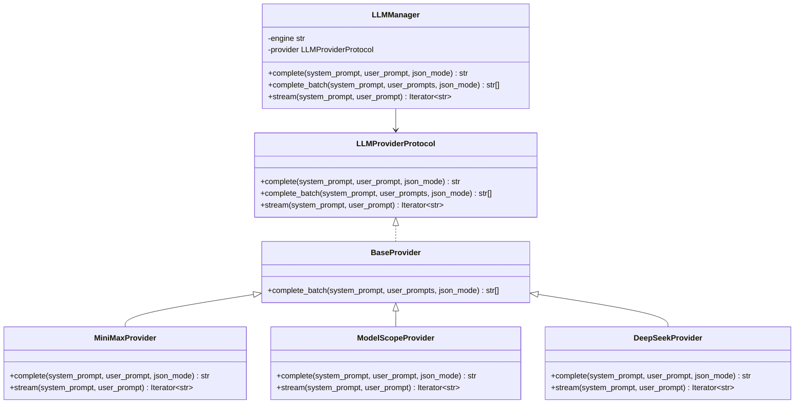
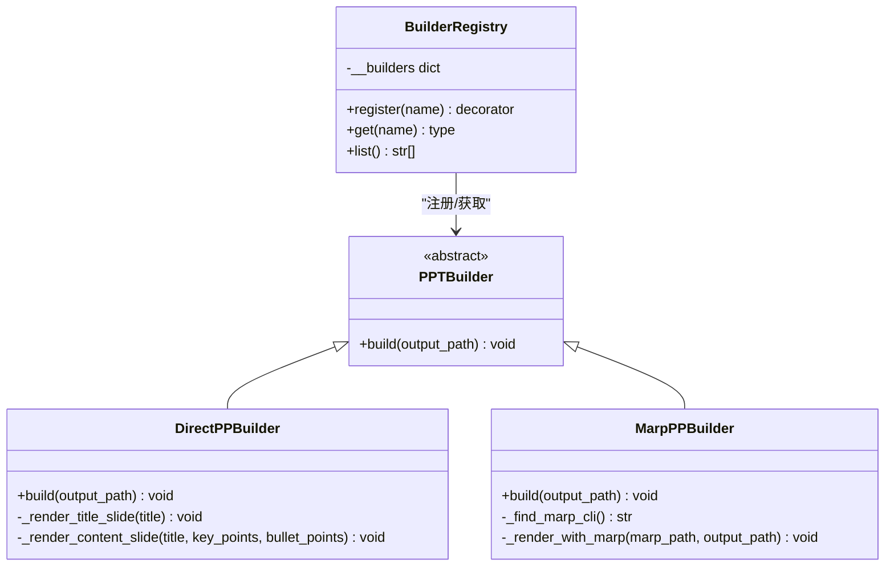
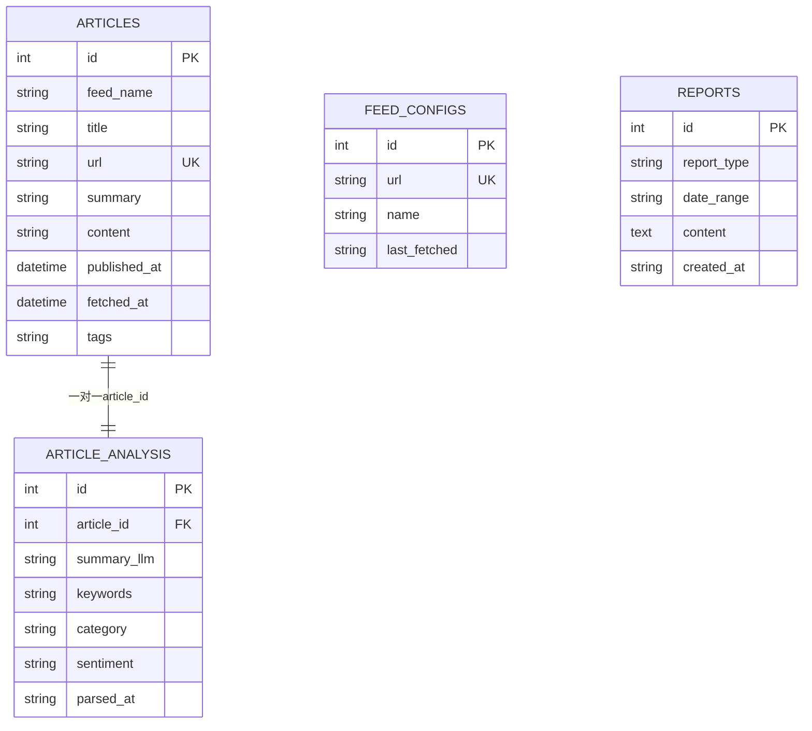
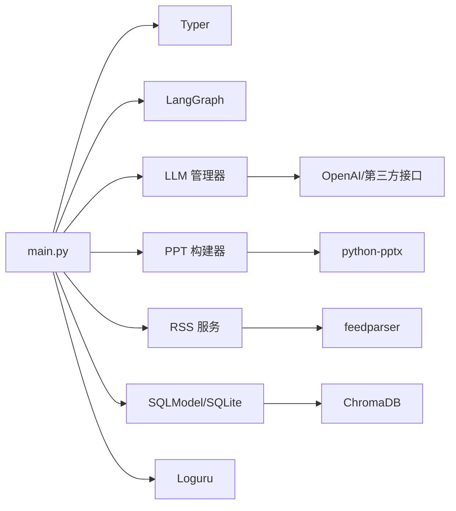

# 技术架构概览

<cite>
**本文档引用的文件**
- [main.py](file://main.py)
- [config.py](file://src/config.py)
- [pyproject.toml](file://pyproject.toml)
- [README.md](file://README.md)
- [src/services/rss.py](file://src/services/rss.py)
- [src/storage/db.py](file://src/storage/db.py)
- [src/storage/vector_store.py](file://src/storage/vector_store.py)
- [src/storage/logger.py](file://src/storage/logger.py)
- [src/render/ppt/base.py](file://src/render/ppt/base.py)
- [src/render/ppt/builder.py](file://src/render/ppt/builder.py)
- [src/render/ppt/marp_builder.py](file://src/render/ppt/marp_builder.py)
- [src/render/ppt/__init__.py](file://src/render/ppt/__init__.py)
- [src/agents/report_workflow.py](file://src/agents/report_workflow.py)
- [src/llm/manager.py](file://src/llm/manager.py)
- [config.yaml](file://config.yaml)
</cite>

## 目录
1. [简介](#简介)
2. [项目结构](#项目结构)
3. [核心组件](#核心组件)
4. [架构总览](#架构总览)
5. [详细组件分析](#详细组件分析)
6. [依赖关系分析](#依赖关系分析)
7. [性能考量](#性能考量)
8. [故障排查指南](#故障排查指南)
9. [结论](#结论)

## 简介
Brief Agent 是一个基于 CLI 的 RSS 日报自动化平台，围绕“RSS 数据采集 → AI 智能分析 → 报告生成 → PPT 渲染”的完整工作流展开。系统采用分层架构（CLI 层、服务层、数据层），结合插件化设计（Provider 与构建器注册机制），通过 Typer 提供命令行入口，LangGraph 实现工作流编排，SQLModel 管理 SQLite，feedparser 解析 RSS，python-pptx 与 Marp 支持 PPT 渲染，ChromaDB 提供向量检索能力，Loguru 统一日志管理。

## 项目结构
项目采用按职责分层的模块化组织方式：
- CLI 层：Typer 命令入口，负责用户交互与流程编排
- 服务层：RSS 抓取、报告生成工作流、LLM 管理
- 数据层：SQLite（SQLModel）、向量数据库（ChromaDB）、日志（Loguru）
- 渲染层：PPT 构建器（Direct 与 Marp 两种策略）

**图表来源**
- [main.py](file://main.py#L22-L227)
- [src/services/rss.py](file://src/services/rss.py#L15-L123)
- [src/agents/report_workflow.py](file://src/agents/report_workflow.py#L186-L238)
- [src/llm/manager.py](file://src/llm/manager.py#L206-L318)
- [src/storage/db.py](file://src/storage/db.py#L65-L251)
- [src/storage/vector_store.py](file://src/storage/vector_store.py#L15-L142)
- [src/storage/logger.py](file://src/storage/logger.py#L8-L39)
- [src/render/ppt/base.py](file://src/render/ppt/base.py#L7-L42)
- [src/render/ppt/builder.py](file://src/render/ppt/builder.py#L22-L194)
- [src/render/ppt/marp_builder.py](file://src/render/ppt/marp_builder.py#L21-L94)

**章节来源**
- [main.py](file://main.py#L1-L227)
- [README.md](file://README.md#L87-L148)

## 核心组件
- CLI 命令与入口
  - fetch：抓取 RSS 源并入库
  - parse：调用 LLM 对未解析文章进行结构化分析
  - report：生成日报并可选输出 PPT
  - serve：预留 Web 服务入口
- 配置系统
  - YAML 配置 + 环境变量注入，支持多 Provider 的 LLM、RSS 源、数据库、向量库、日志与调度
- RSS 服务
  - feedparser 解析，BeautifulSoup 清洗，HTTPX 请求，批量入库
- 数据存储
  - SQLModel 管理 SQLite，提供 Upsert、查询、报告持久化
  - ChromaDB 向量库，支持语义检索与 RAG
- LLM 管理
  - Provider 抽象与注册，统一 complete/stream/batch 接口
  - 支持 MiniMax、ModelScope、DeepSeek
- 报告工作流（LangGraph）
  - StateGraph：收集 → 组织 → 生成 → 保存
- PPT 渲染
  - 注册表模式：Direct 与 Marp 两种构建器
  - Direct：python-pptx 直接渲染
  - Marp：JSON → Marp Markdown → PPT

**章节来源**
- [main.py](file://main.py#L66-L141)
- [src/config.py](file://src/config.py#L74-L109)
- [src/services/rss.py](file://src/services/rss.py#L15-L123)
- [src/storage/db.py](file://src/storage/db.py#L65-L251)
- [src/storage/vector_store.py](file://src/storage/vector_store.py#L15-L142)
- [src/llm/manager.py](file://src/llm/manager.py#L206-L318)
- [src/agents/report_workflow.py](file://src/agents/report_workflow.py#L186-L238)
- [src/render/ppt/base.py](file://src/render/ppt/base.py#L16-L42)

## 架构总览
系统采用“命令驱动 + 工作流编排 + 插件化 Provider + 多存储”的分层设计。CLI 作为入口协调各子系统；服务层负责业务编排；数据层提供持久化与检索；渲染层通过注册表模式扩展不同输出策略。

**图表来源**
- [main.py](file://main.py#L14-L21)
- [src/services/rss.py](file://src/services/rss.py#L15-L32)
- [src/agents/report_workflow.py](file://src/agents/report_workflow.py#L186-L202)
- [src/llm/manager.py](file://src/llm/manager.py#L206-L281)
- [src/storage/db.py](file://src/storage/db.py#L65-L82)
- [src/storage/vector_store.py](file://src/storage/vector_store.py#L15-L35)
- [src/render/ppt/base.py](file://src/render/ppt/base.py#L16-L42)
- [src/render/ppt/builder.py](file://src/render/ppt/builder.py#L22-L63)
- [src/render/ppt/marp_builder.py](file://src/render/ppt/marp_builder.py#L21-L40)
- [src/storage/logger.py](file://src/storage/logger.py#L8-L39)

## 详细组件分析

### CLI 层与命令流程
- fetch：加载配置 → 初始化数据库 → RSSFetcher 抓取 → 批量入库
- parse：加载日志 → 获取未解析文章 → 批量调用 LLM 分析 → 统计结果
- report：校验日期 → 生成日报（LangGraph）→ 可选打印 → 生成 PPT（构建器注册表）
- serve：占位命令，当前未实现

**图表来源**
- [main.py](file://main.py#L66-L141)
- [src/agents/report_workflow.py](file://src/agents/report_workflow.py#L217-L237)
- [src/llm/manager.py](file://src/llm/manager.py#L297-L318)
- [src/render/ppt/base.py](file://src/render/ppt/base.py#L31-L36)

**章节来源**
- [main.py](file://main.py#L66-L141)

### RSS 采集与解析
- 使用 feedparser 解析 XML，BeautifulSoup 清洗 HTML，HTTPX 发起请求
- 按 feed 配置逐个抓取，去重入库（URL 唯一键）
- 支持定时调度（RSSScheduler）

**图表来源**
- [src/services/rss.py](file://src/services/rss.py#L34-L60)
- [src/storage/db.py](file://src/storage/db.py#L97-L122)

**章节来源**
- [src/services/rss.py](file://src/services/rss.py#L15-L123)

### 报告生成工作流（LangGraph）
- StateGraph 定义：collect → organize → generate → save
- collect：按日期范围查询已解析文章
- organize：按 category 分类并排序
- generate：拼装提示词，调用 LLM 生成结构化报告
- save：持久化报告

**图表来源**
- [src/agents/report_workflow.py](file://src/agents/report_workflow.py#L186-L202)
- [src/agents/report_workflow.py](file://src/agents/report_workflow.py#L46-L93)
- [src/agents/report_workflow.py](file://src/agents/report_workflow.py#L95-L161)
- [src/agents/report_workflow.py](file://src/agents/report_workflow.py#L163-L182)

**章节来源**
- [src/agents/report_workflow.py](file://src/agents/report_workflow.py#L25-L182)

### LLM Provider 体系
- Provider 抽象：统一 complete/stream/batch 接口
- Provider 实现：MiniMax、ModelScope、DeepSeek
- 管理器：根据配置选择 Provider，支持回退到环境变量
- 批量推理：ThreadPoolExecutor 并行执行

**图表来源**
- [src/llm/manager.py](file://src/llm/manager.py#L24-L41)
- [src/llm/manager.py](file://src/llm/manager.py#L45-L63)
- [src/llm/manager.py](file://src/llm/manager.py#L67-L104)
- [src/llm/manager.py](file://src/llm/manager.py#L162-L202)
- [src/llm/manager.py](file://src/llm/manager.py#L206-L318)

**章节来源**
- [src/llm/manager.py](file://src/llm/manager.py#L206-L318)

### PPT 构建器与注册机制
- 注册表：BuilderRegistry 维护名称到构建器类的映射
- Direct 构建器：LLM 生成设计蓝图，python-pptx 直接渲染
- Marp 构建器：JSON → Marp Markdown → PPT（依赖系统安装的 Marp CLI）

**图表来源**
- [src/render/ppt/base.py](file://src/render/ppt/base.py#L7-L42)
- [src/render/ppt/builder.py](file://src/render/ppt/builder.py#L22-L194)
- [src/render/ppt/marp_builder.py](file://src/render/ppt/marp_builder.py#L21-L94)

**章节来源**
- [src/render/ppt/base.py](file://src/render/ppt/base.py#L16-L42)
- [src/render/ppt/builder.py](file://src/render/ppt/builder.py#L22-L194)
- [src/render/ppt/marp_builder.py](file://src/render/ppt/marp_builder.py#L21-L94)

### 数据模型与存储
- SQLModel 模型：Article、ArticleAnalysis、FeedConfig、Report
- 数据库：WAL 模式 + 超时配置，支持并发读写
- 向量库：SentenceTransformer 嵌入，ChromaDB 持久化集合

**图表来源**
- [src/storage/db.py](file://src/storage/db.py#L14-L61)

**章节来源**
- [src/storage/db.py](file://src/storage/db.py#L65-L251)
- [src/storage/vector_store.py](file://src/storage/vector_store.py#L15-L142)

## 依赖关系分析
- 核心依赖
  - Typer：CLI 命令行框架
  - LangGraph/LangChain：工作流编排与链式调用
  - feedparser：RSS 解析
  - python-pptx：PPT 直接渲染
  - ChromaDB + sentence-transformers：RAG 向量检索
  - Loguru：结构化日志
  - Pydantic + YAML：配置模型与加载
  - SQLModel + SQLite：ORM 与轻量数据库
- 运行时脚本
  - main.py 作为命令入口，注册 brief 命令

**图表来源**
- [pyproject.toml](file://pyproject.toml#L7-L29)
- [main.py](file://main.py#L11-L21)

**章节来源**
- [pyproject.toml](file://pyproject.toml#L1-L49)
- [main.py](file://main.py#L11-L21)

## 性能考量
- 数据库
  - WAL 模式与超时设置提升并发读写稳定性
  - 批量 Upsert 与批量向量添加减少 IO 次数
- LLM
  - 批量推理使用线程池并行，降低总体延迟
  - 流式生成按 Provider 支持情况启用
- RSS
  - HTTPX 超时与重定向处理，避免阻塞
- PPT
  - Direct 构建器直接渲染，Marp 构建器依赖系统 CLI，注意环境准备

[本节为通用指导，无需特定文件引用]

## 故障排查指南
- 配置问题
  - 确认 config.yaml 与 .env 正确设置 API Key 与路径
  - 使用环境变量回退机制验证 Provider 初始化
- 日志定位
  - 使用 _setup_logging 控制日志级别与轮转
  - 关注 RSS 抓取与解析异常、向量库嵌入失败、PPT 渲染 CLI 缺失
- 数据一致性
  - 检查 URL 唯一键约束导致的重复入库
  - 报告保存失败时查看数据库事务与异常堆栈
- LLM 调用
  - Provider 初始化失败时检查 API Key 与网络连通性
  - 批量推理失败时关注线程池与超时设置

**章节来源**
- [src/storage/logger.py](file://src/storage/logger.py#L8-L39)
- [src/services/rss.py](file://src/services/rss.py#L34-L48)
- [src/storage/vector_store.py](file://src/storage/vector_store.py#L36-L54)
- [src/render/ppt/marp_builder.py](file://src/render/ppt/marp_builder.py#L38-L57)
- [src/llm/manager.py](file://src/llm/manager.py#L253-L295)

## 结论
Brief Agent 通过清晰的分层架构与插件化设计，实现了从 RSS 数据采集到 AI 智能分析再到报告与 PPT 输出的完整闭环。Typer 提供简洁的 CLI 入口，LangGraph 保证工作流稳定可扩展，SQLModel 与 ChromaDB 提供可靠的数据与检索能力，LLM Provider 体系与注册表模式使系统具备良好的可替换性与可维护性。建议后续完善 Web UI、引入 Token 管理与可视化，并持续优化批处理与缓存策略以提升吞吐与成本控制。