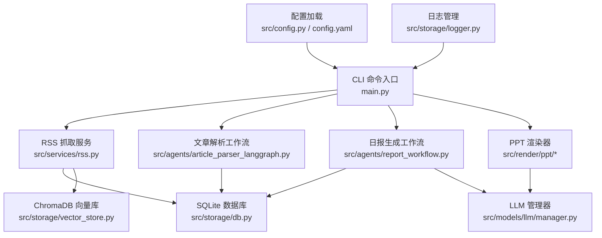
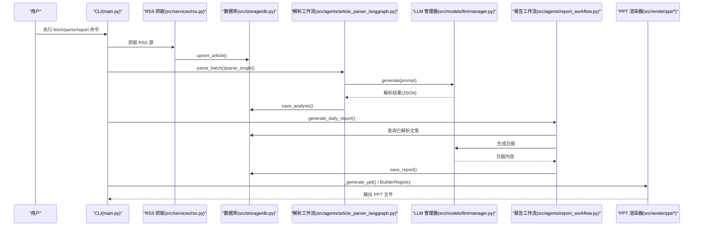
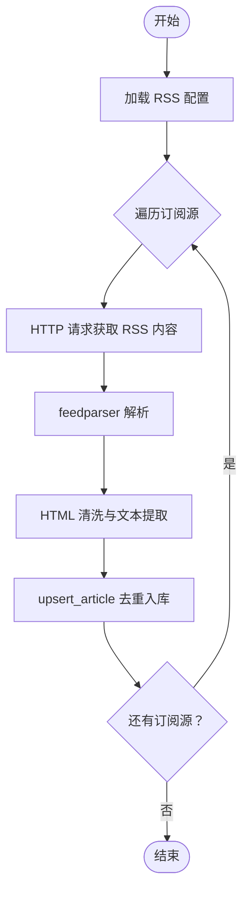
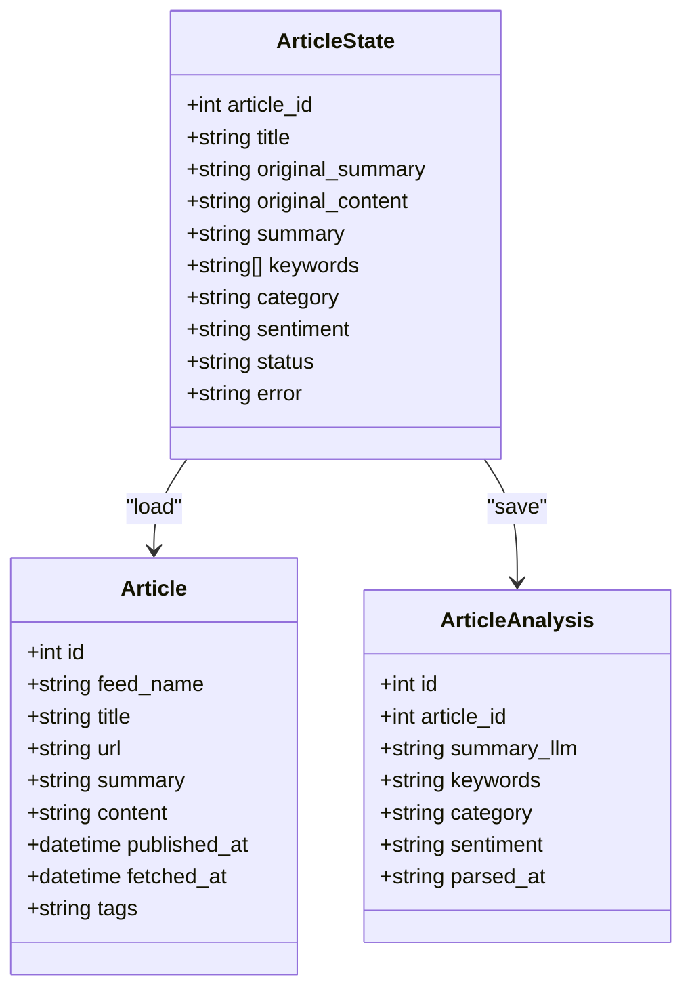
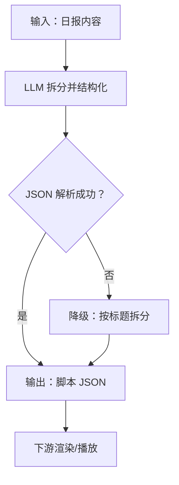
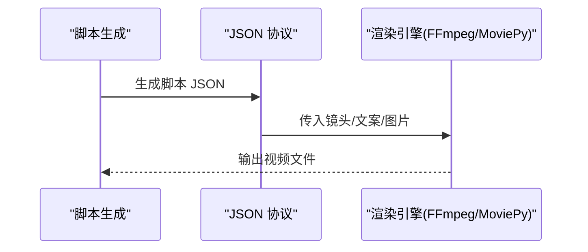
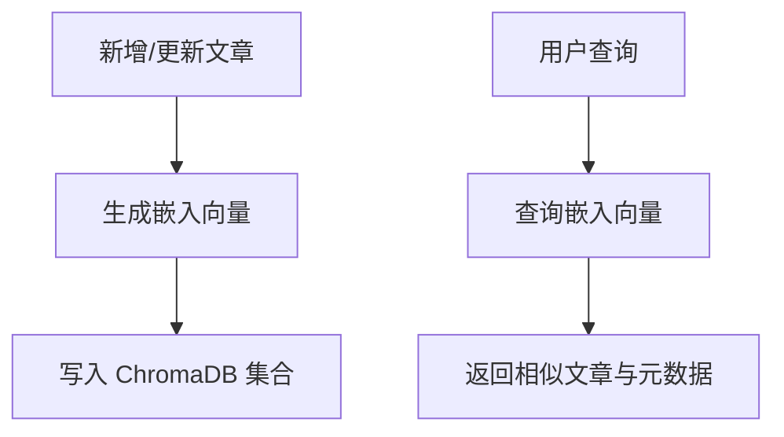
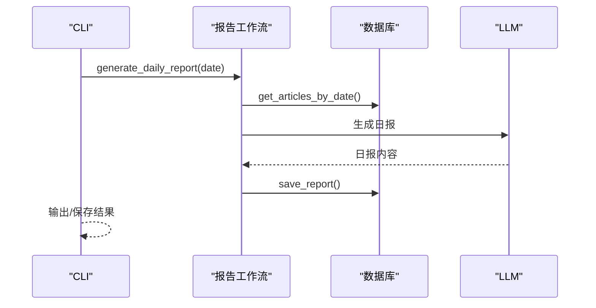
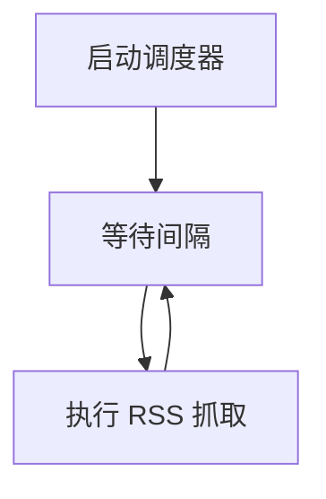
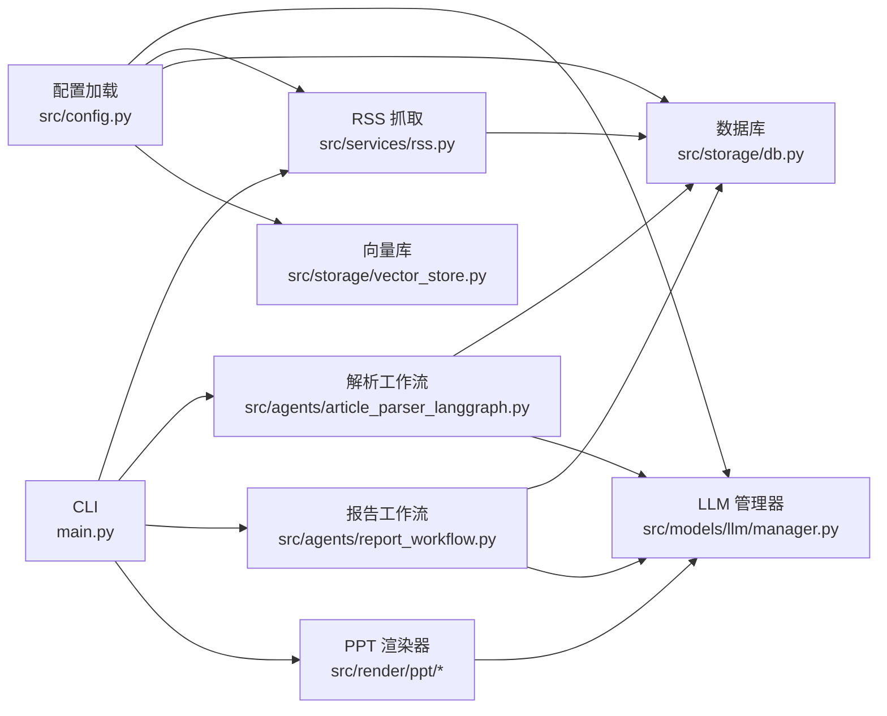

# 核心功能特性

<cite>
**本文档引用的文件**
- [README.md](file://README.md)
- [CLAUDE.md](file://CLAUDE.md)
- [config.yaml](file://config.yaml)
- [main.py](file://main.py)
- [src/config.py](file://src/config.py)
- [src/services/rss.py](file://src/services/rss.py)
- [src/storage/db.py](file://src/storage/db.py)
- [src/storage/vector_store.py](file://src/storage/vector_store.py)
- [src/agents/report_workflow.py](file://src/agents/report_workflow.py)
- [src/agents/article_parser_langgraph.py](file://src/agents/article_parser_langgraph.py)
- [src/render/ppt/base.py](file://src/render/ppt/base.py)
- [src/render/ppt/builder.py](file://src/render/ppt/builder.py)
- [src/render/ppt/marp_builder.py](file://src/render/ppt/marp_builder.py)
- [src/render/ppt/__init__.py](file://src/render/ppt/__init__.py)
- [src/models/llm/manager.py](file://src/models/llm/manager.py)
- [src/storage/logger.py](file://src/storage/logger.py)
</cite>

## 目录
1. [简介](#简介)
2. [项目结构](#项目结构)
3. [核心组件](#核心组件)
4. [架构总览](#架构总览)
5. [详细组件分析](#详细组件分析)
6. [依赖关系分析](#依赖关系分析)
7. [性能考量](#性能考量)
8. [故障排查指南](#故障排查指南)
9. [结论](#结论)
10. [附录](#附录)

## 简介
Brief Agent 是一个企业级多模态知识内生 Agent 平台，围绕“RSS 多源采集 → 文章智能解析 → 日/周报生成 → PPT 渲染输出”的自动化内容生产流水线构建。其核心能力包括：
- 多源数据采集：RSS 订阅管理与定时抓取
- AI 智能分析：基于 LangGraph 的多 Agent 协作（文章解析、报告生成等）
- 短视频脚本生成：将资讯转化为具备短视频逻辑的脚本（概念性说明）
- 视频渲染输出：JSON 生产协议驱动 FFmpeg/MoviePy（概念性说明）
- RAG 向量化检索：基于 ChromaDB 的语义搜索与知识增强
- 日报/周报生成：自动汇总生成结构化报告
- 定时任务调度：支持按需配置定时执行

该平台通过清晰的模块划分与可扩展的配置体系，实现从数据采集到内容输出的端到端自动化。

## 项目结构
项目采用“配置 → 服务 → 存储 → 智能体 → 渲染”的分层架构，CLI 入口提供 fetch/parse/report 等命令，配合 LLM 管理器、RSS 抓取服务、数据库与向量库，以及 PPT 渲染器完成闭环。

图表来源
- [main.py](file://main.py#L66-L141)
- [src/services/rss.py](file://src/services/rss.py#L15-L61)
- [src/agents/article_parser_langgraph.py](file://src/agents/article_parser_langgraph.py#L156-L181)
- [src/agents/report_workflow.py](file://src/agents/report_workflow.py#L186-L201)
- [src/render/ppt/builder.py](file://src/render/ppt/builder.py#L22-L63)
- [src/render/ppt/marp_builder.py](file://src/render/ppt/marp_builder.py#L21-L40)
- [src/storage/db.py](file://src/storage/db.py#L65-L94)
- [src/storage/vector_store.py](file://src/storage/vector_store.py#L15-L35)
- [src/models/llm/manager.py](file://src/models/llm/manager.py#L206-L252)
- [src/config.py](file://src/config.py#L74-L89)
- [src/storage/logger.py](file://src/storage/logger.py#L8-L39)

章节来源
- [README.md](file://README.md#L87-L148)
- [CLAUDE.md](file://CLAUDE.md#L39-L95)

## 核心组件
- 配置系统：集中管理 LLM 提供商、RSS 源、数据库、向量库、日志与调度器配置，并支持环境变量注入。
- RSS 抓取服务：解析 RSS/Atom 源，清洗 HTML，入库去重，支持定时循环抓取。
- 数据存储：SQLite（SQLModel）持久化文章与解析结果；向量库用于 RAG 语义检索。
- 智能体工作流：文章解析与日报生成均基于 LangGraph，状态机驱动节点式处理。
- LLM 管理器：统一接入 MiniMax/ModelScope/DeepSeek，支持单次、批量与流式推理。
- PPT 渲染器：两种模式（direct 与 marp），支持模板与 JSON 协议驱动输出。
- 日志系统：基于 loguru 的结构化日志，支持文件轮转与控制台输出。

章节来源
- [src/config.py](file://src/config.py#L74-L109)
- [config.yaml](file://config.yaml#L1-L54)
- [src/services/rss.py](file://src/services/rss.py#L15-L61)
- [src/storage/db.py](file://src/storage/db.py#L65-L94)
- [src/storage/vector_store.py](file://src/storage/vector_store.py#L15-L35)
- [src/agents/article_parser_langgraph.py](file://src/agents/article_parser_langgraph.py#L156-L181)
- [src/agents/report_workflow.py](file://src/agents/report_workflow.py#L186-L201)
- [src/models/llm/manager.py](file://src/models/llm/manager.py#L206-L318)
- [src/render/ppt/base.py](file://src/render/ppt/base.py#L7-L42)
- [src/render/ppt/builder.py](file://src/render/ppt/builder.py#L22-L63)
- [src/render/ppt/marp_builder.py](file://src/render/ppt/marp_builder.py#L21-L40)
- [src/storage/logger.py](file://src/storage/logger.py#L8-L39)

## 架构总览
Brief Agent 的运行时由 CLI 驱动，核心流程如下：
- 数据采集：CLI 调用 RSS 抓取服务，解析并入库。
- 内容解析：CLI 调用文章解析工作流，使用 LLM 一次性完成摘要、关键词、分类与情感分析，并落库。
- 报告生成：CLI 调用日报工作流，按分类组织文章，生成结构化报告并保存。
- PPT 输出：CLI 调用 PPT 渲染器，将报告结构化为 PPT（direct 或 marp 模式）。

图表来源
- [main.py](file://main.py#L66-L141)
- [src/services/rss.py](file://src/services/rss.py#L22-L61)
- [src/agents/article_parser_langgraph.py](file://src/agents/article_parser_langgraph.py#L205-L226)
- [src/agents/report_workflow.py](file://src/agents/report_workflow.py#L217-L238)
- [src/render/ppt/builder.py](file://src/render/ppt/builder.py#L128-L151)
- [src/render/ppt/marp_builder.py](file://src/render/ppt/marp_builder.py#L59-L94)

## 详细组件分析

### 多源数据采集（RSS 订阅管理与定时抓取）
- 实现原理
  - RSS 抓取器使用 feedparser 解析 RSS/Atom，httpx 发起请求并设置超时与重定向跟随。
  - 文章入库前进行 HTML 清洗，提取标题、链接、摘要与正文，按 URL 去重。
  - 提供定时调度器，按配置周期循环抓取。
- 使用场景
  - 企业资讯聚合、行业动态监控、竞品情报收集。
- 技术优势
  - 异常隔离与日志记录，支持多源并发抓取。
- 实际应用价值
  - 为后续解析与报告生成提供高质量原始素材。

图表来源
- [src/services/rss.py](file://src/services/rss.py#L22-L61)
- [src/services/rss.py](file://src/services/rss.py#L62-L107)

章节来源
- [src/services/rss.py](file://src/services/rss.py#L15-L123)
- [config.yaml](file://config.yaml#L23-L31)
- [src/storage/db.py](file://src/storage/db.py#L97-L123)

### AI 智能分析（文章解析工作流与多 Agent 协作）
- 实现原理
  - 文章解析工作流（LangGraph）三节点：load → parse → save。
  - 单次 LLM 推理完成摘要、关键词、分类与情感分析，JSON 校验与降级处理。
  - 报告工作流（LangGraph）四节点：collect → organize → generate → save。
  - LLM 管理器统一封装 MiniMax/ModelScope/DeepSeek，支持批量与流式。
- 使用场景
  - 自动化内容筛选、主题分类、情感分析、结构化摘要。
- 技术优势
  - 状态机驱动，错误可恢复；一次 LLM 调用完成多项任务，降低延迟。
- 实际应用价值
  - 为报告生成与检索增强提供高质量结构化元数据。

图表来源
- [src/agents/article_parser_langgraph.py](file://src/agents/article_parser_langgraph.py#L26-L42)
- [src/storage/db.py](file://src/storage/db.py#L14-L40)

章节来源
- [src/agents/article_parser_langgraph.py](file://src/agents/article_parser_langgraph.py#L66-L152)
- [src/agents/report_workflow.py](file://src/agents/report_workflow.py#L46-L182)
- [src/models/llm/manager.py](file://src/models/llm/manager.py#L206-L318)

### 短视频脚本生成（资讯转化为短视频逻辑脚本）
- 实现原理
  - 通过 LLM 将结构化报告内容拆解为短视频脚本，包含镜头、旁白、要点等字段。
  - 支持降级策略：当 LLM 返回非 JSON 时，按标题规则进行简单拆分。
- 使用场景
  - 快节奏资讯传播、短视频平台内容二次创作。
- 技术优势
  - JSON 协议驱动，便于与渲染引擎对接。
- 实际应用价值
  - 提升内容分发效率与传播覆盖面。

图表来源
- [main.py](file://main.py#L143-L206)

章节来源
- [main.py](file://main.py#L29-L51)
- [main.py](file://main.py#L143-L206)

### 视频渲染输出（JSON 生产协议驱动 FFmpeg/MoviePy）
- 实现原理
  - 通过 JSON 协议定义镜头、文案、图片位置等，交由渲染引擎（MoviePy/FFmpeg）执行合成。
  - 本仓库提供 PPT 渲染器作为本地输出示例，短视频渲染可复用相同协议思想。
- 使用场景
  - 企业内部培训、产品演示、营销短片。
- 技术优势
  - 协议化输出，便于扩展至多平台渲染管线。
- 实际应用价值
  - 标准化内容资产，降低人工制作成本。

图表来源
- [main.py](file://main.py#L143-L206)

章节来源
- [main.py](file://main.py#L143-L206)

### RAG 向量化检索（基于 ChromaDB 的语义搜索与知识增强）
- 实现原理
  - 使用 sentence-transformers 为文章标题与摘要生成向量，存入 ChromaDB。
  - 支持按关键词语义检索，可限定来源或时间范围。
- 使用场景
  - 知识问答、专题检索、跨源关联分析。
- 技术优势
  - 本地持久化，无需云端依赖；支持增量更新与删除。
- 实际应用价值
  - 提升内容复用与交叉洞察效率。

图表来源
- [src/storage/vector_store.py](file://src/storage/vector_store.py#L36-L97)

章节来源
- [src/storage/vector_store.py](file://src/storage/vector_store.py#L15-L142)
- [config.yaml](file://config.yaml#L37-L41)

### 日报/周报生成（自动汇总生成结构化报告）
- 实现原理
  - 报告工作流按日期范围收集已解析文章，按分类组织，调用 LLM 生成结构化日报，保存至数据库。
  - CLI 提供 report 命令，支持打印到标准输出与生成 PPT。
- 使用场景
  - 固定周期的知识汇总、团队站会、管理层简报。
- 技术优势
  - LangGraph 状态机保证流程可控；结构化输出便于二次加工。
- 实际应用价值
  - 降低信息整理成本，提升知识沉淀质量。

图表来源
- [src/agents/report_workflow.py](file://src/agents/report_workflow.py#L217-L238)
- [src/storage/db.py](file://src/storage/db.py#L227-L239)
- [main.py](file://main.py#L107-L141)

章节来源
- [src/agents/report_workflow.py](file://src/agents/report_workflow.py#L186-L238)
- [src/storage/db.py](file://src/storage/db.py#L227-L251)
- [main.py](file://main.py#L107-L141)

### 定时任务调度（支持按需配置定时执行）
- 实现原理
  - RSS 定时调度器基于时间轮询，按配置周期抓取。
  - 配置文件支持时区、日报/周报生成时间等调度参数。
- 使用场景
  - 自动化内容采集与报告生成，减少人工干预。
- 技术优势
  - 简单可靠，易于集成到系统守护进程或容器编排。
- 实际应用价值
  - 形成稳定的“采集-解析-产出”闭环。

图表来源
- [src/services/rss.py](file://src/services/rss.py#L117-L123)
- [config.yaml](file://config.yaml#L49-L54)

章节来源
- [src/services/rss.py](file://src/services/rss.py#L110-L123)
- [config.yaml](file://config.yaml#L49-L54)

## 依赖关系分析
- 配置与环境
  - 配置加载模块负责解析 YAML 并注入环境变量，确保 LLM 提供商、数据库与向量库路径正确。
- 数据与检索
  - 数据库负责文章与解析结果的持久化；向量库负责语义检索；二者通过文章 ID 关联。
- 智能体与 LLM
  - 文章解析与报告生成均依赖 LLM 管理器；解析阶段强调一次调用完成多项任务，报告阶段强调结构化输出。
- 渲染与输出
  - PPT 渲染器通过注册机制支持多种构建器；CLI 通过 BuilderRegistry 获取构建器并输出文件。

图表来源
- [src/config.py](file://src/config.py#L74-L89)
- [src/models/llm/manager.py](file://src/models/llm/manager.py#L206-L252)
- [src/services/rss.py](file://src/services/rss.py#L15-L61)
- [src/storage/db.py](file://src/storage/db.py#L65-L94)
- [src/storage/vector_store.py](file://src/storage/vector_store.py#L15-L35)
- [src/agents/article_parser_langgraph.py](file://src/agents/article_parser_langgraph.py#L156-L181)
- [src/agents/report_workflow.py](file://src/agents/report_workflow.py#L186-L201)
- [src/render/ppt/base.py](file://src/render/ppt/base.py#L16-L42)
- [main.py](file://main.py#L66-L141)

章节来源
- [src/config.py](file://src/config.py#L74-L109)
- [src/render/ppt/__init__.py](file://src/render/ppt/__init__.py#L8-L20)

## 性能考量
- 数据库
  - SQLite 采用 WAL 模式与超时配置，提升并发读写稳定性；建议在高并发场景引入连接池或迁移至更高性能数据库。
- LLM 调用
  - 批量推理使用线程池并发调用，减少总耗时；注意不同提供商的限流与配额。
- 向量检索
  - 向量维度固定，建议定期维护集合大小与索引；对高频查询可增加缓存层。
- 渲染输出
  - PPT 渲染依赖本地库，建议在 CI/CD 环境预装依赖；短视频渲染可采用 GPU 加速框架。

## 故障排查指南
- RSS 抓取失败
  - 检查网络连通性与订阅源可用性；查看日志定位 HTTP 错误与解析异常。
- LLM 返回格式错误
  - 解析 JSON 失败时触发降级策略；检查提示词与 JSON 格式约束。
- 数据库锁与超时
  - SQLite 默认超时较短，可通过配置调整；避免长时间持有事务。
- PPT 渲染失败
  - direct 模式依赖 python-pptx；marp 模式依赖 marp CLI，需确认安装路径与模板存在。

章节来源
- [src/services/rss.py](file://src/services/rss.py#L37-L48)
- [src/agents/article_parser_langgraph.py](file://src/agents/article_parser_langgraph.py#L126-L131)
- [src/storage/db.py](file://src/storage/db.py#L72-L90)
- [src/render/ppt/builder.py](file://src/render/ppt/builder.py#L75-L84)
- [src/render/ppt/marp_builder.py](file://src/render/ppt/marp_builder.py#L40-L58)
- [src/storage/logger.py](file://src/storage/logger.py#L8-L39)

## 结论
Brief Agent 通过清晰的模块边界与可配置的流水线，实现了从多源数据采集到结构化报告与 PPT 输出的自动化闭环。其 LangGraph 工作流、统一 LLM 管理器与本地向量库，构成了可扩展的知识内生与内容生成基础设施。未来可在任务编排、费用追踪与多模态渲染方面进一步演进，持续提升生产效率与内容质量。

## 附录
- 快速开始与常用命令参见项目自述与 Claude 助手文档。
- 环境变量与模块导入规范详见 CLAUDE.md。

章节来源
- [README.md](file://README.md#L17-L86)
- [CLAUDE.md](file://CLAUDE.md#L101-L121)
- [CLAUDE.md](file://CLAUDE.md#L197-L280)