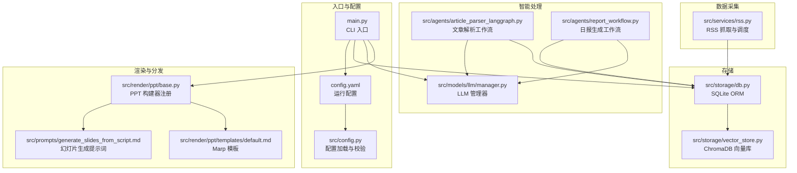
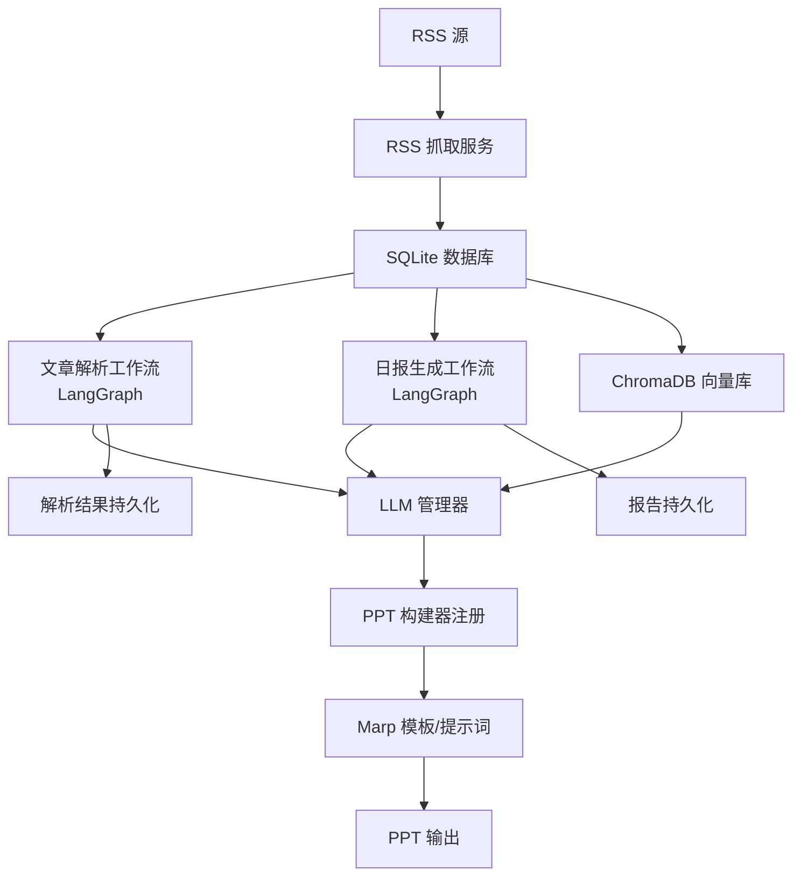
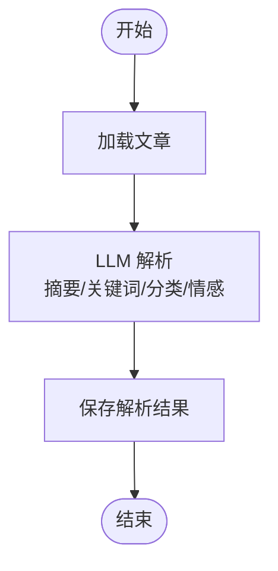
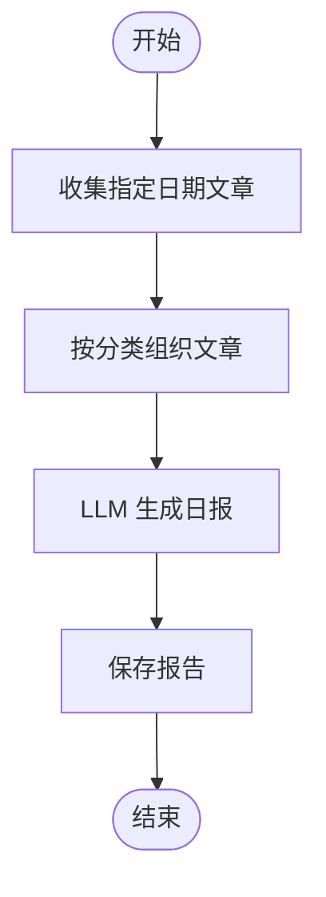
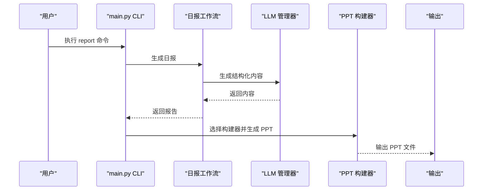
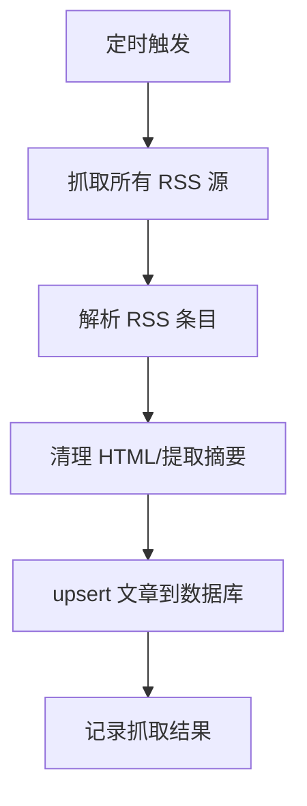
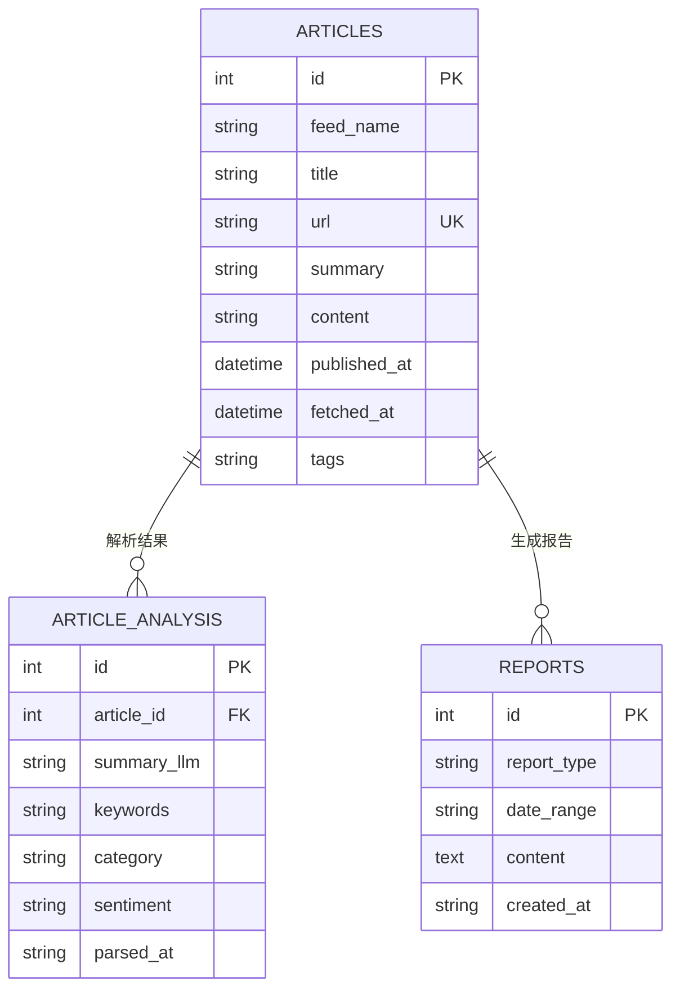
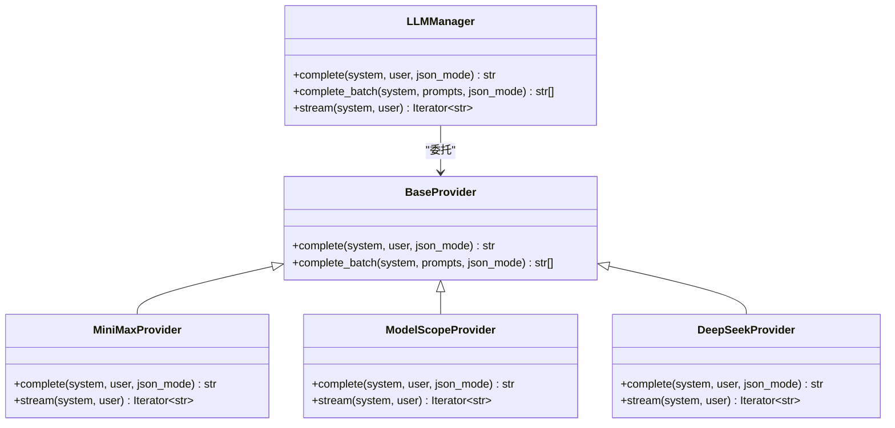
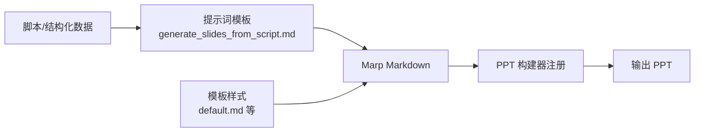
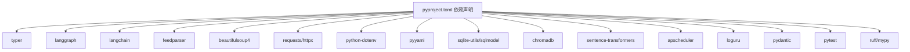

# 项目介绍

<cite>
**本文引用的文件**
- [README.md](file://README.md)
- [main.py](file://main.py)
- [config.yaml](file://config.yaml)
- [src/config.py](file://src/config.py)
- [src/agents/article_parser_langgraph.py](file://src/agents/article_parser_langgraph.py)
- [src/agents/report_workflow.py](file://src/agents/report_workflow.py)
- [src/services/rss.py](file://src/services/rss.py)
- [src/storage/db.py](file://src/storage/db.py)
- [src/storage/vector_store.py](file://src/storage/vector_store.py)
- [src/models/llm/manager.py](file://src/models/llm/manager.py)
- [src/render/ppt/base.py](file://src/render/ppt/base.py)
- [src/prompts/generate_slides_from_script.md](file://src/prompts/generate_slides_from_script.md)
- [src/render/ppt/templates/default.md](file://src/render/ppt/templates/default.md)
- [scripts/fetch_sample.py](file://scripts/fetch_sample.py)
- [pyproject.toml](file://pyproject.toml)
</cite>

## 目录
1. [引言](#引言)
2. [项目结构](#项目结构)
3. [核心组件](#核心组件)
4. [架构总览](#架构总览)
5. [详细组件分析](#详细组件分析)
6. [依赖关系分析](#依赖关系分析)
7. [性能考量](#性能考量)
8. [故障排查指南](#故障排查指南)
9. [结论](#结论)
10. [附录](#附录)

## 引言
Brief Agent 是一个“向内看”的企业级多模态知识内生 Agent 平台，目标是像 NotebookLM 一样，把“知识内生”和“内容自动生成与分发”做到极致。它基于 LangGraph 构建多 Agent 协作工作流，围绕 RSS 内容采集、LLM 智能解析、结构化报告生成、PPT 渲染输出、RAG 向量化检索与定时任务调度等能力，形成一条从“信息采集—智能处理—结构化产出—多模态分发”的闭环流水线。

本项目旨在帮助团队实现：
- 企业知识管理：自动抓取、清洗、解析、向量化、检索与复用
- 内容自动化生产：从资讯到日报、再到 PPT 的一键生成
- 多模态内容分发：文本、PPT、视频脚本等多形态输出
- 多 Agent 协作：不同角色的 Agent 各司其职，协同完成复杂任务
- RAG 增强：通过向量检索增强 LLM 的上下文质量
- 定时任务调度：按需配置周期性任务，稳定可靠地运行

## 项目结构
项目采用“功能域+分层”的组织方式，核心目录与职责如下：
- scripts：辅助脚本（示例抓取、模板测试等）
- skills：Claude Code Skills（代码审查、测试生成、视觉审查）
- src：核心代码
  - agents：基于 LangGraph 的多 Agent 工作流（文章解析、报告生成、图片生成等）
  - models：外部模型 API 封装（LLM、图像、音频等）
  - services：业务服务（RSS 抓取、RSS 定时调度）
  - storage：数据存储（SQLite、ChromaDB 向量库、日志）
  - render：渲染层（PPT 构建器、模板）
  - prompts：提示词模板
- 配置与入口：config.yaml、src/config.py、main.py、pyproject.toml

图表来源
- [main.py](file://main.py#L1-L227)
- [config.yaml](file://config.yaml#L1-L54)
- [src/config.py](file://src/config.py#L1-L109)
- [src/services/rss.py](file://src/services/rss.py#L1-L123)
- [src/agents/article_parser_langgraph.py](file://src/agents/article_parser_langgraph.py#L1-L241)
- [src/agents/report_workflow.py](file://src/agents/report_workflow.py#L1-L266)
- [src/models/llm/manager.py](file://src/models/llm/manager.py#L1-L318)
- [src/storage/db.py](file://src/storage/db.py#L1-L251)
- [src/storage/vector_store.py](file://src/storage/vector_store.py#L1-L142)
- [src/render/ppt/base.py](file://src/render/ppt/base.py#L1-L42)
- [src/prompts/generate_slides_from_script.md](file://src/prompts/generate_slides_from_script.md#L1-L62)
- [src/render/ppt/templates/default.md](file://src/render/ppt/templates/default.md#L1-L36)

章节来源
- [README.md](file://README.md#L87-L148)
- [pyproject.toml](file://pyproject.toml#L1-L49)

## 核心组件
- CLI 与入口
  - main.py 提供 fetch、parse、report、serve 等命令，支持日志、PPT 输出与构建器选择
- 配置系统
  - config.yaml 定义 LLM 提供商、RSS 源、数据库、向量库、日志与调度参数；src/config.py 负责加载与类型校验
- RSS 采集与调度
  - RSSFetcher 负责抓取 RSS 源并入库；RSSScheduler 提供定时抓取
- 智能处理（LangGraph 工作流）
  - 文章解析工作流：单次 LLM 调用完成摘要、关键词、分类、情感等抽取，并持久化
  - 日报生成工作流：按分类组织文章，调用 LLM 生成结构化日报并保存
- 存储层
  - SQLite（SQLModel）：文章、解析结果、报告、订阅源配置
  - ChromaDB：文章标题与摘要向量化，支持语义检索
- LLM 管理器
  - 统一封装 MiniMax、ModelScope、DeepSeek，支持单次、批量与流式生成
- 渲染与分发
  - PPT 构建器注册机制，支持多种构建器（Direct、Marp 等）
  - 提示词模板与 Marp 模板，支撑从脚本到幻灯片的结构化输出

章节来源
- [main.py](file://main.py#L1-L227)
- [config.yaml](file://config.yaml#L1-L54)
- [src/config.py](file://src/config.py#L1-L109)
- [src/services/rss.py](file://src/services/rss.py#L1-L123)
- [src/agents/article_parser_langgraph.py](file://src/agents/article_parser_langgraph.py#L1-L241)
- [src/agents/report_workflow.py](file://src/agents/report_workflow.py#L1-L266)
- [src/storage/db.py](file://src/storage/db.py#L1-L251)
- [src/storage/vector_store.py](file://src/storage/vector_store.py#L1-L142)
- [src/models/llm/manager.py](file://src/models/llm/manager.py#L1-L318)
- [src/render/ppt/base.py](file://src/render/ppt/base.py#L1-L42)

## 架构总览
Brief Agent 的整体架构围绕“采集—解析—生成—渲染—存储—调度”展开，采用 LangGraph 将多 Agent 协作与状态流转可视化、可扩展。

图表来源
- [src/services/rss.py](file://src/services/rss.py#L1-L123)
- [src/storage/db.py](file://src/storage/db.py#L1-L251)
- [src/agents/article_parser_langgraph.py](file://src/agents/article_parser_langgraph.py#L1-L241)
- [src/agents/report_workflow.py](file://src/agents/report_workflow.py#L1-L266)
- [src/models/llm/manager.py](file://src/models/llm/manager.py#L1-L318)
- [src/render/ppt/base.py](file://src/render/ppt/base.py#L1-L42)
- [src/render/ppt/templates/default.md](file://src/render/ppt/templates/default.md#L1-L36)
- [src/storage/vector_store.py](file://src/storage/vector_store.py#L1-L142)

## 详细组件分析

### 文章解析工作流（LangGraph）
该工作流以“加载—解析—保存”三节点串联，单次 LLM 调用完成摘要、关键词、分类与情感抽取，随后将结果写入 article_analysis 表，便于后续重跑与审计。

图表来源
- [src/agents/article_parser_langgraph.py](file://src/agents/article_parser_langgraph.py#L66-L151)

章节来源
- [src/agents/article_parser_langgraph.py](file://src/agents/article_parser_langgraph.py#L1-L241)

### 日报生成工作流（LangGraph）
该工作流从数据库按日期收集已解析文章，按分类组织，再调用 LLM 生成结构化日报，最后保存至 reports 表。

图表来源
- [src/agents/report_workflow.py](file://src/agents/report_workflow.py#L46-L181)

章节来源
- [src/agents/report_workflow.py](file://src/agents/report_workflow.py#L1-L266)

### CLI 命令与 PPT 生成流程
CLI 提供 fetch、parse、report、serve 等命令。其中 report 命令支持将日报内容结构化为 PPT，通过 LLM 智能拆分并使用构建器生成输出。

图表来源
- [main.py](file://main.py#L107-L188)
- [src/agents/report_workflow.py](file://src/agents/report_workflow.py#L217-L237)
- [src/models/llm/manager.py](file://src/models/llm/manager.py#L206-L318)
- [src/render/ppt/base.py](file://src/render/ppt/base.py#L16-L42)

章节来源
- [main.py](file://main.py#L1-L227)

### RSS 采集与调度
RSS 抓取服务负责解析 RSS 源，清理 HTML，去重入库；RSSScheduler 提供定时抓取能力，支持配置抓取间隔与超时。

图表来源
- [src/services/rss.py](file://src/services/rss.py#L22-L60)

章节来源
- [src/services/rss.py](file://src/services/rss.py#L1-L123)

### 存储与检索
- SQLite（SQLModel）：维护文章、解析结果、报告、订阅源配置等结构化数据
- ChromaDB：对文章标题与摘要进行向量化，支持按订阅源或日期范围检索

图表来源
- [src/storage/db.py](file://src/storage/db.py#L14-L61)

章节来源
- [src/storage/db.py](file://src/storage/db.py#L1-L251)
- [src/storage/vector_store.py](file://src/storage/vector_store.py#L1-L142)

### LLM 管理器与多提供商支持
统一的 LLM 管理器封装了 MiniMax、ModelScope、DeepSeek，支持单次、批量与流式生成，便于在不同提供商间切换与扩展。

图表来源
- [src/models/llm/manager.py](file://src/models/llm/manager.py#L206-L318)

章节来源
- [src/models/llm/manager.py](file://src/models/llm/manager.py#L1-L318)

### 多模态内容分发（PPT 与提示词）
- PPT 构建器注册机制：通过注册表选择构建器（如 Direct、Marp），统一接口生成 PPT
- 提示词模板：将脚本结构化为 Marp Markdown 幻灯片，支持两列布局、封面/深色/结尾等样式
- 模板：提供默认/极简/商务/渐变/暗黑等风格，满足不同场景

图表来源
- [src/render/ppt/base.py](file://src/render/ppt/base.py#L16-L42)
- [src/prompts/generate_slides_from_script.md](file://src/prompts/generate_slides_from_script.md#L1-L62)
- [src/render/ppt/templates/default.md](file://src/render/ppt/templates/default.md#L1-L36)

章节来源
- [src/render/ppt/base.py](file://src/render/ppt/base.py#L1-L42)
- [src/prompts/generate_slides_from_script.md](file://src/prompts/generate_slides_from_script.md#L1-L62)
- [src/render/ppt/templates/default.md](file://src/render/ppt/templates/default.md#L1-L36)

## 依赖关系分析
项目使用 uv 管理依赖，核心第三方库包括：
- typer：命令行接口
- langgraph/langchain：LangGraph 工作流与链式调用
- feedparser/beautifulsoup4/requests/httpx：RSS 抓取与解析
- python-dotenv/pyyaml：环境变量与配置加载
- sqlite-utils/sqlmodel：SQLite ORM
- chromadb/sentence-transformers：向量检索
- apscheduler：定时任务
- loguru：日志
- pydantic：配置校验
- pytest/ruff/mypy：开发工具链

图表来源
- [pyproject.toml](file://pyproject.toml#L7-L29)

章节来源
- [pyproject.toml](file://pyproject.toml#L1-L49)

## 性能考量
- LangGraph 工作流：通过明确的状态节点与单次 LLM 调用减少往返次数，提高吞吐
- 批量解析：文章解析与报告生成均支持批量处理，降低 LLM 调用成本
- SQLite WAL 模式：启用 WAL 提升并发读写性能
- 向量检索：ChromaDB 持久化客户端与嵌入模型，支持高效语义检索
- 日志轮转：loguru 支持大小轮转与保留策略，保障长期运行稳定性

章节来源
- [src/agents/article_parser_langgraph.py](file://src/agents/article_parser_langgraph.py#L205-L225)
- [src/agents/report_workflow.py](file://src/agents/report_workflow.py#L217-L237)
- [src/storage/db.py](file://src/storage/db.py#L84-L89)
- [src/storage/vector_store.py](file://src/storage/vector_store.py#L15-L35)
- [config.yaml](file://config.yaml#L42-L47)

## 故障排查指南
- 环境变量缺失
  - 确认 .env 文件已复制并填写 API Key；config.yaml 中的 ${VAR} 会被替换
- RSS 抓取失败
  - 检查 RSS 源 URL 是否可达、超时设置是否合理；查看日志中的错误信息
- LLM 推理异常
  - 确认所选提供商配置正确；必要时切换到其他提供商；检查网络与代理
- PPT 生成失败
  - 若 LLM 返回格式错误，CLI 会降级为简单拆分；检查提示词与构建器选择
- 数据库/向量库异常
  - 确认数据库路径存在且可写；ChromaDB 路径与集合名正确

章节来源
- [src/config.py](file://src/config.py#L91-L109)
- [src/services/rss.py](file://src/services/rss.py#L34-L60)
- [main.py](file://main.py#L143-L205)
- [src/storage/db.py](file://src/storage/db.py#L64-L82)
- [src/storage/vector_store.py](file://src/storage/vector_store.py#L15-L35)

## 结论
Brief Agent 以 LangGraph 为核心，构建了从“信息采集—智能解析—结构化生成—多模态分发”的企业级 Agent 平台。其优势在于：
- 多 Agent 协作与状态化工作流，使复杂任务可编排、可观测
- RAG 增强与向量检索，显著提升知识内生与复用能力
- 定时任务调度与 CLI 工具链，便于落地与运维
- 多提供商 LLM 管理器与多模态渲染，满足多样化场景需求

对于初学者，建议先从 CLI 命令入手，理解 fetch、parse、report 的基本流程，再逐步探索 LangGraph 工作流与提示词工程，最终实现企业级的知识内生与内容自动化。

## 附录

### 快速上手步骤
- 环境准备与依赖安装
- 配置 .env 与 config.yaml
- 添加 RSS 订阅源
- 运行 fetch、parse、report 命令
- 查看输出（控制台与 output 目录）

章节来源
- [README.md](file://README.md#L17-L85)
- [config.yaml](file://config.yaml#L1-L54)
- [scripts/fetch_sample.py](file://scripts/fetch_sample.py#L1-L69)