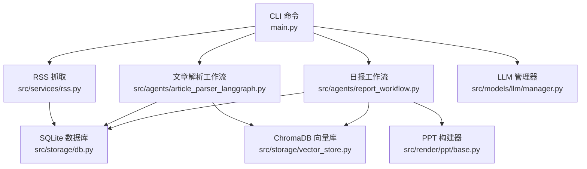
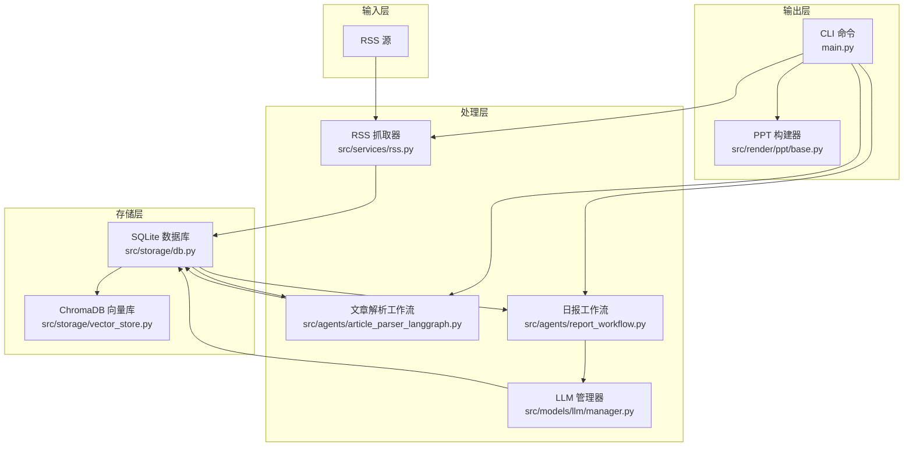
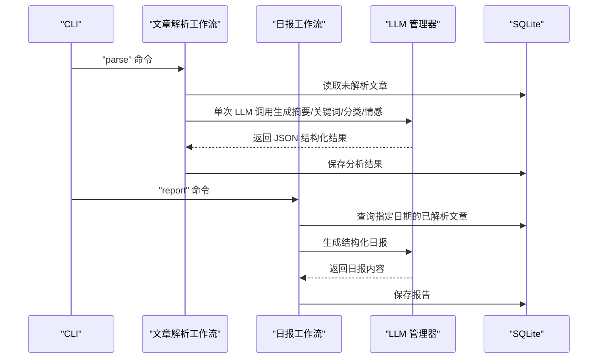
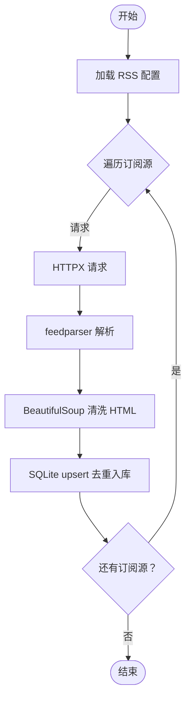
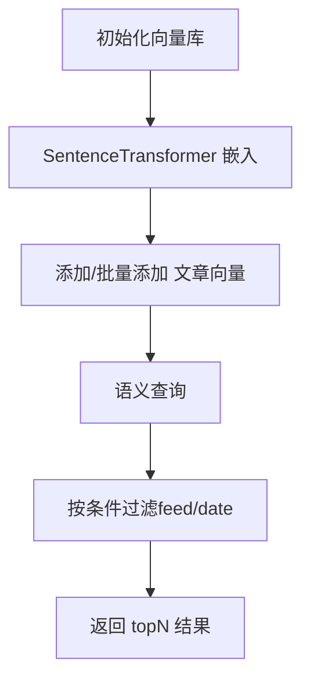
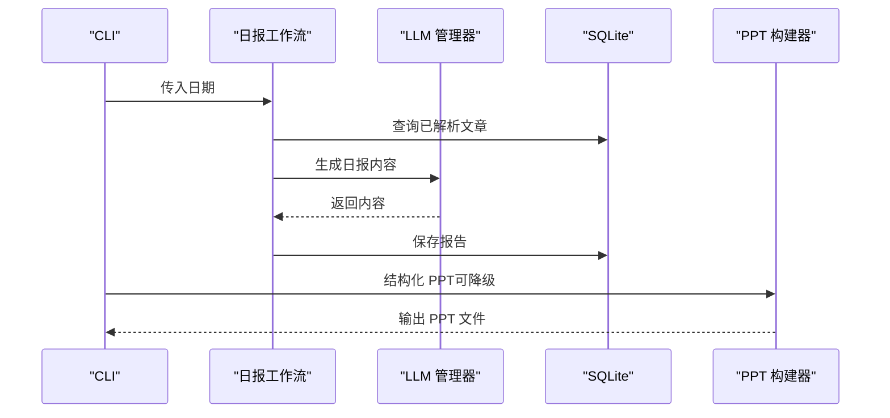
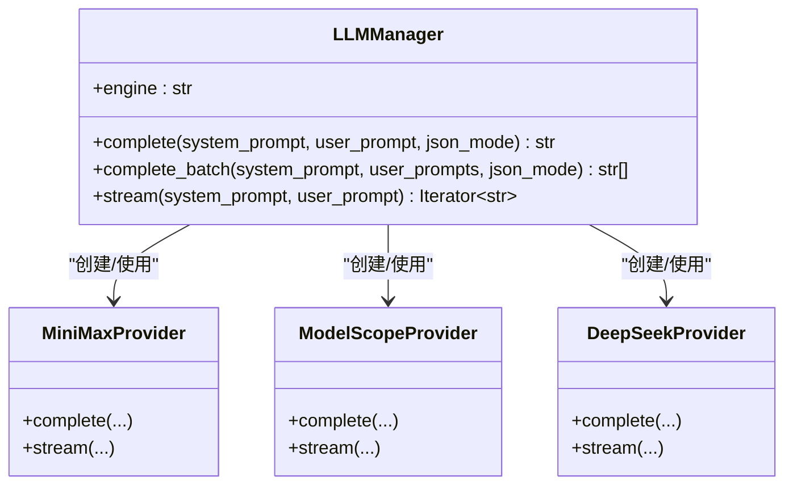
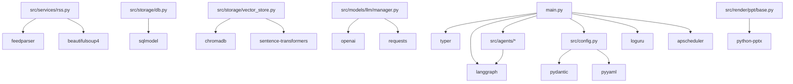

# 项目概述

<cite>
**本文档引用的文件**
- [README.md](file://README.md)
- [main.py](file://main.py)
- [config.yaml](file://config.yaml)
- [src/config.py](file://src/config.py)
- [src/agents/article_parser_langgraph.py](file://src/agents/article_parser_langgraph.py)
- [src/agents/report_workflow.py](file://src/agents/report_workflow.py)
- [src/services/rss.py](file://src/services/rss.py)
- [src/storage/db.py](file://src/storage/db.py)
- [src/storage/vector_store.py](file://src/storage/vector_store.py)
- [src/render/ppt/base.py](file://src/render/ppt/base.py)
- [src/models/llm/manager.py](file://src/models/llm/manager.py)
- [src/llm/manager.py](file://src/llm/manager.py)
- [scripts/fetch_sample.py](file://scripts/fetch_sample.py)
- [src/prompts/generate_slides_from_script.md](file://src/prompts/generate_slides_from_script.md)
- [pyproject.toml](file://pyproject.toml)
</cite>

## 目录
1. [简介](#简介)
2. [项目结构](#项目结构)
3. [核心组件](#核心组件)
4. [架构总览](#架构总览)
5. [详细组件分析](#详细组件分析)
6. [依赖关系分析](#依赖关系分析)
7. [性能考量](#性能考量)
8. [故障排查指南](#故障排查指南)
9. [结论](#结论)
10. [附录](#附录)

## 简介
Brief Agent 是一个基于 LangGraph 的企业级多模态知识内生 Agent 平台，目标是“把 NotebookLM 学习一番”，打造从 RSS 多源数据采集、AI 智能分析、到短视频脚本生成与视频渲染输出的完整内容生产流水线。项目强调多 Agent 协作与 RAG 向量化检索能力，支持日报/周报自动化生成，并通过 CLI 提供一键化的数据采集、解析与报告生成能力。

- 多源数据采集：RSS 订阅管理与定时抓取
- AI 智能分析：基于 LangGraph 的多 Agent 协作（分析师、编剧、结构化专家、审核员等角色分工）
- 短视频脚本生成：将资讯转化为具备短视频逻辑的脚本
- 视频渲染输出：JSON 生产协议驱动 FFmpeg/MoviePy 渲染
- RAG 向量化检索：基于 ChromaDB 的语义搜索与知识增强
- 日报/周报生成：自动汇总生成结构化报告
- 定时任务调度：支持按需配置定时执行

## 项目结构
项目采用按职责分层的组织方式，核心模块包括：
- CLI 入口与命令：main.py
- 配置加载：src/config.py + config.yaml
- 业务服务：RSS 抓取 src/services/rss.py
- 存储层：SQLite 数据库与 ChromaDB 向量库
- LLM 管理：src/models/llm/manager.py 与 src/llm/manager.py（双实现）
- Agent 工作流：src/agents/*（LangGraph）
- 渲染层：PPT 构建器与模板（src/render/ppt/*）

图表来源
- [main.py](file://main.py#L66-L141)
- [src/services/rss.py](file://src/services/rss.py#L15-L61)
- [src/agents/article_parser_langgraph.py](file://src/agents/article_parser_langgraph.py#L156-L181)
- [src/agents/report_workflow.py](file://src/agents/report_workflow.py#L186-L213)
- [src/storage/db.py](file://src/storage/db.py#L65-L94)
- [src/storage/vector_store.py](file://src/storage/vector_store.py#L15-L35)
- [src/models/llm/manager.py](file://src/models/llm/manager.py#L206-L318)
- [src/render/ppt/base.py](file://src/render/ppt/base.py#L16-L42)

章节来源
- [README.md](file://README.md#L87-L148)
- [pyproject.toml](file://pyproject.toml#L1-L49)

## 核心组件
- CLI 与命令入口：提供 fetch、parse、report、serve 等命令，支持日志配置、PPT 生成与降级策略
- 配置系统：基于 Pydantic 的强类型配置加载，支持环境变量替换与多提供商 LLM 配置
- RSS 服务：抓取 RSS 源、解析条目、清洗 HTML、去重入库
- 数据存储：SQLite（SQLModel）持久化文章、解析结果与报告；ChromaDB 向量库用于 RAG
- LLM 管理：统一接口封装 MiniMax、ModelScope、DeepSeek，支持单次/批量/流式调用
- Agent 工作流：LangGraph 实现文章解析与日报生成的多节点工作流
- 渲染层：PPT 构建器注册机制与多种模板风格

章节来源
- [main.py](file://main.py#L1-L227)
- [src/config.py](file://src/config.py#L74-L109)
- [src/services/rss.py](file://src/services/rss.py#L15-L123)
- [src/storage/db.py](file://src/storage/db.py#L65-L251)
- [src/storage/vector_store.py](file://src/storage/vector_store.py#L15-L142)
- [src/models/llm/manager.py](file://src/models/llm/manager.py#L206-L318)
- [src/llm/manager.py](file://src/llm/manager.py#L206-L318)
- [src/agents/article_parser_langgraph.py](file://src/agents/article_parser_langgraph.py#L156-L241)
- [src/agents/report_workflow.py](file://src/agents/report_workflow.py#L186-L266)
- [src/render/ppt/base.py](file://src/render/ppt/base.py#L16-L42)

## 架构总览
Brief Agent 的整体架构围绕“数据采集—智能分析—结构化产出—渲染输出”展开，结合 LangGraph 的工作流能力与 LLM 的多模态能力，形成可扩展的企业级内容生产平台。

图表来源
- [src/services/rss.py](file://src/services/rss.py#L15-L61)
- [src/agents/article_parser_langgraph.py](file://src/agents/article_parser_langgraph.py#L156-L181)
- [src/agents/report_workflow.py](file://src/agents/report_workflow.py#L186-L213)
- [src/storage/db.py](file://src/storage/db.py#L65-L94)
- [src/storage/vector_store.py](file://src/storage/vector_store.py#L15-L35)
- [src/models/llm/manager.py](file://src/models/llm/manager.py#L206-L318)
- [main.py](file://main.py#L66-L141)
- [src/render/ppt/base.py](file://src/render/ppt/base.py#L16-L42)

## 详细组件分析

### 多 Agent 协作与角色分工
- 分析师：负责从原始文章中抽取摘要、关键词、分类与情感倾向，形成结构化分析结果
- 编剧：将结构化文章按领域分类，生成面向读者的日报内容
- 结构化专家：将日报内容进一步结构化为 PPT 幻灯片数据
- 审核员：负责校验与修正生成内容的质量与一致性（概念性角色，当前实现聚焦于结构化与渲染）

图表来源
- [src/agents/article_parser_langgraph.py](file://src/agents/article_parser_langgraph.py#L66-L151)
- [src/agents/report_workflow.py](file://src/agents/report_workflow.py#L46-L182)
- [src/models/llm/manager.py](file://src/models/llm/manager.py#L297-L318)
- [src/storage/db.py](file://src/storage/db.py#L147-L191)

章节来源
- [src/agents/article_parser_langgraph.py](file://src/agents/article_parser_langgraph.py#L1-L241)
- [src/agents/report_workflow.py](file://src/agents/report_workflow.py#L1-L266)

### RSS 数据采集与定时抓取
- RSS 抓取器负责遍历配置中的订阅源，解析 XML/Atom，清洗 HTML，去重入库
- 支持超时控制与 Bozo 异常处理
- 定时抓取调度器通过轮询实现周期性抓取

图表来源
- [src/services/rss.py](file://src/services/rss.py#L22-L61)
- [src/storage/db.py](file://src/storage/db.py#L97-L123)

章节来源
- [src/services/rss.py](file://src/services/rss.py#L15-L123)
- [src/storage/db.py](file://src/storage/db.py#L95-L166)

### RAG 向量化检索与知识增强
- 向量库使用 ChromaDB，嵌入模型为 all-MiniLM-L6-v2
- 支持按 feed_name 与日期范围检索
- 可与文章解析/报告生成结合，实现语义增强

图表来源
- [src/storage/vector_store.py](file://src/storage/vector_store.py#L15-L142)

章节来源
- [src/storage/vector_store.py](file://src/storage/vector_store.py#L15-L142)

### 日报/周报生成与 PPT 渲染
- 日报工作流按日期收集已解析文章，按分类组织，调用 LLM 生成结构化日报并保存
- CLI 支持将日报结构化为 PPT，内置降级策略以防 LLM 返回格式异常
- PPT 构建器采用注册机制，支持多种实现（DirectPPBuilder、MarpBuilder 等）

图表来源
- [src/agents/report_workflow.py](file://src/agents/report_workflow.py#L186-L238)
- [main.py](file://main.py#L143-L189)
- [src/render/ppt/base.py](file://src/render/ppt/base.py#L16-L42)

章节来源
- [src/agents/report_workflow.py](file://src/agents/report_workflow.py#L1-L266)
- [main.py](file://main.py#L143-L206)
- [src/render/ppt/base.py](file://src/render/ppt/base.py#L16-L42)

### LLM 管理与多提供商适配
- 统一接口支持 complete、complete_batch、stream
- 支持 MiniMax、ModelScope、DeepSeek 三种提供商
- 支持从配置文件与环境变量加载

图表来源
- [src/models/llm/manager.py](file://src/models/llm/manager.py#L206-L318)
- [src/llm/manager.py](file://src/llm/manager.py#L206-L318)

章节来源
- [src/models/llm/manager.py](file://src/models/llm/manager.py#L1-L318)
- [src/llm/manager.py](file://src/llm/manager.py#L1-L318)

### 配置系统与环境变量
- 配置文件支持 LLM 多提供商、RSS 源、数据库、向量库、日志与调度等
- 环境变量通过 ${VAR} 语法注入，支持回退到环境变量

章节来源
- [config.yaml](file://config.yaml#L1-L54)
- [src/config.py](file://src/config.py#L74-L109)

## 依赖关系分析
项目依赖以 Python 生态为主，关键依赖包括：
- CLI 与命令行：typer
- LangGraph/LangChain：工作流与链式调用
- RSS 解析：feedparser、BeautifulSoup
- HTTP 客户端：httpx
- 数据库：SQLModel（SQLite）、ChromaDB
- 向量嵌入：sentence-transformers
- 调度：APScheduler
- 日志：loguru
- 类型与配置：pydantic、pyyaml
- PPT 渲染：python-pptx

图表来源
- [pyproject.toml](file://pyproject.toml#L7-L29)
- [main.py](file://main.py#L14-L21)
- [src/services/rss.py](file://src/services/rss.py#L4-L12)
- [src/storage/db.py](file://src/storage/db.py#L8-L9)
- [src/storage/vector_store.py](file://src/storage/vector_store.py#L7-L9)
- [src/models/llm/manager.py](file://src/models/llm/manager.py#L71-L173)
- [src/render/ppt/base.py](file://src/render/ppt/base.py#L1-L42)
- [src/config.py](file://src/config.py#L7-L11)

章节来源
- [pyproject.toml](file://pyproject.toml#L1-L49)

## 性能考量
- 数据库并发：SQLite 启用 WAL 模式与 busy_timeout，提升并发读写稳定性
- 批量处理：LLM 批量推理使用线程池，提高吞吐
- 向量检索：ChromaDB 持久化客户端，按 feed_name 与日期范围过滤，减少无关匹配
- 日志与输出：CLI 支持详细日志级别与输出文件轮转，便于定位性能瓶颈

章节来源
- [src/storage/db.py](file://src/storage/db.py#L84-L90)
- [src/models/llm/manager.py](file://src/models/llm/manager.py#L57-L62)
- [src/storage/vector_store.py](file://src/storage/vector_store.py#L23-L31)
- [main.py](file://main.py#L54-L63)

## 故障排查指南
- RSS 抓取失败：检查订阅源 URL、网络超时与 Bozo 异常；查看日志输出
- LLM 返回格式异常：CLI 提供降级方案，将结构化失败的文章按标题简单拆分
- 数据库锁/并发冲突：确认 SQLite WAL 模式已启用，适当调整 busy_timeout
- 向量库检索无结果：确认嵌入模型初始化成功，集合存在且非空
- PPT 构建失败：确认构建器名称有效，输出路径可写

章节来源
- [src/services/rss.py](file://src/services/rss.py#L34-L61)
- [main.py](file://main.py#L151-L162)
- [src/storage/db.py](file://src/storage/db.py#L84-L90)
- [src/storage/vector_store.py](file://src/storage/vector_store.py#L33-L35)
- [src/render/ppt/base.py](file://src/render/ppt/base.py#L32-L36)

## 结论
Brief Agent 以 LangGraph 为核心，结合多提供商 LLM、SQLite 与 ChromaDB，构建了从 RSS 数据采集到结构化报告与 PPT 渲染的完整流水线。其模块化设计与 CLI 驱动的运行方式，既适合初学者快速上手，也为有经验的开发者提供了扩展与定制的空间。未来可进一步完善 PPT Agent、Token 管理系统与视觉评估 Review Agent 等能力。

## 附录
- 快速开始与配置示例见 README 与 config.yaml
- 示例脚本 scripts/fetch_sample.py 展示了如何快速抓取真实 RSS 源
- 提示词模板 src/prompts/generate_slides_from_script.md 用于从脚本生成 Marp 幻灯片

章节来源
- [README.md](file://README.md#L17-L86)
- [config.yaml](file://config.yaml#L1-L54)
- [scripts/fetch_sample.py](file://scripts/fetch_sample.py#L16-L69)
- [src/prompts/generate_slides_from_script.md](file://src/prompts/generate_slides_from_script.md#L1-L62)